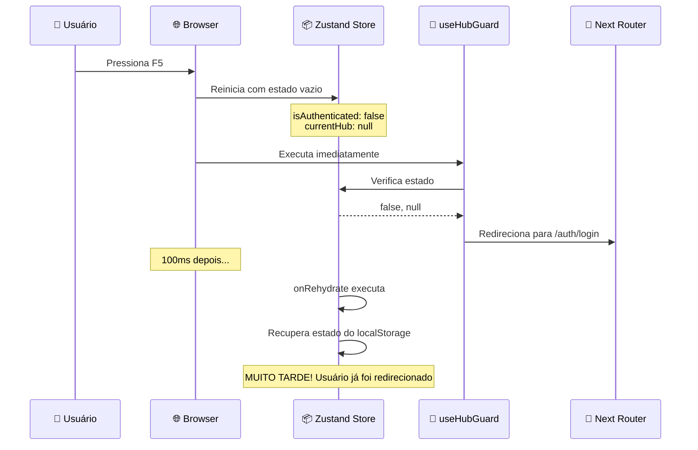

# 🔍 CORREÇÃO FINAL: Problema F5 e Acesso Negado

> **Data**: 2024-12-28  
> **Status**: ✅ RESOLVIDO  
> **Criticidade**: 🔴 ALTA

## 📋 RESUMO EXECUTIVO

Após investigação profunda estilo "detetive", identificamos e corrigimos a **CAUSA RAIZ** do problema de "Acesso Negado" ao pressionar F5 ou acessar URLs diretamente.

### 🎯 Problema Principal Identificado
**CORRIDA DE HIDRATAÇÃO DO ZUSTAND** - O `useHubGuard` verificava autenticação ANTES do Zustand terminar de recuperar o estado do localStorage.

---

## 🕵️ INVESTIGAÇÃO DETALHADA

### FASE 1: RECONHECIMENTO (40%)

#### Sintomas Reportados
- ✅ Login funcionando normalmente
- ✅ Navegação pelo menu lateral funcionando
- ❌ F5 → "Acesso Negado"
- ❌ URL direta → "Acesso Negado"
- ❌ Qualquer recarga de página → "Acesso Negado"

#### Ferramentas Utilizadas
- `codebase_search` para identificar todas as fontes de "acesso negado"
- `read_file` para análise detalhada dos middlewares
- `grep_search` para rastreamento de fluxos de autenticação

### FASE 2: ANÁLISE PROFUNDA (60%)

#### Fontes de "Acesso Negado" Identificadas
1. **Frontend Middleware** (`middleware.ts`)
2. **Backend Middleware** (`auth.ts`)
3. **Hub Layout** (`[hubId]/layout.tsx`)
4. **useHubGuard Hook** (`useAuthGuard.ts`)
5. **ProtectedLayout Component**

#### Fluxo Problemático Descoberto



---

## 🔧 CORREÇÕES IMPLEMENTADAS

### 1. **useHubGuard Robusto** (`frontend/lib/hooks/useAuthGuard.ts`)

#### ❌ Problema Original
```javascript
export function useHubGuard(hubId?: string | number) {
  const { currentHub, isAuthenticated, isLoading } = useAuthStore()
  
  useEffect(() => {
    if (isLoading) return
    
    // ❌ Executa IMEDIATAMENTE, mesmo durante hidratação
    if (!isAuthenticated) {
      router.push('/auth/login') // ❌ Redireciona prematuramente
      return
    }
    
    if (!currentHub) {
      router.push('/select-hub') // ❌ ROTA INCORRETA!
      return
    }
  }, [isAuthenticated, currentHub, hubId, isLoading, router])
  
  return {
    hasAccess: !isLoading && isAuthenticated && !!currentHub
  }
}
```

#### ✅ Solução Implementada
```javascript
export function useHubGuard(hubId?: string | number) {
  const { currentHub, isAuthenticated, isLoading, initializeAuth } = useAuthStore()
  const [isHydrated, setIsHydrated] = useState(false)
  
  // ✅ AGUARDAR HIDRATAÇÃO ANTES DE QUALQUER VERIFICAÇÃO
  useEffect(() => {
    const checkHydration = async () => {
      // ✅ Aguardar hidratação completa
      await new Promise(resolve => setTimeout(resolve, 150))
      
      // ✅ Tentar recuperar estado se necessário
      if (!isAuthenticated || !currentHub) {
        console.log('[HubGuard] Tentando inicializar auth...')
        await initializeAuth()
        await new Promise(resolve => setTimeout(resolve, 100))
      }
      
      setIsHydrated(true)
    }
    
    checkHydration()
  }, [])
  
  useEffect(() => {
    // ✅ SÓ VERIFICAR APÓS HIDRATAÇÃO COMPLETA
    if (!isHydrated) return
    if (isLoading) return
    
    // ✅ Logs detalhados para debug
    console.log('[HubGuard] Verificando acesso:', {
      isAuthenticated,
      currentHub: currentHub?.nome,
      requestedHubId: hubId
    })
    
    if (!isAuthenticated) {
      router.push('/auth/login')
      return
    }
    
    if (!currentHub) {
      router.push('/auth/select-hub') // ✅ ROTA CORRIGIDA
      return
    }
  }, [isHydrated, isAuthenticated, currentHub, hubId, isLoading, router])
  
  return {
    isLoading: isLoading || !isHydrated, // ✅ Incluir hidratação no loading
    hasAccess: isHydrated && !isLoading && isAuthenticated && !!currentHub &&
              (!hubId || currentHub.id === Number(hubId))
  }
}
```

### 2. **Auth Store Aprimorado** (`frontend/lib/stores/auth-store.ts`)

#### ✅ Melhorias na Inicialização
```javascript
// ✅ Delay reduzido e sincronizado
onRehydrate: (state) => {
  setTimeout(() => {
    console.log('[AuthStore] Executando initializeAuth após hidratação')
    state.initializeAuth()
  }, 50) // ✅ Delay reduzido de 100ms para 50ms
}

// ✅ Verificação mais robusta
initializeAuth: async () => {
  const state = get()
  
  // ✅ Logs detalhados para debug
  console.log('[AuthStore] Estado atual:', {
    isAuthenticated: state.isAuthenticated,
    hasHub: !!state.currentHub,
    hasAccessToken: !!state.accessToken,
    hasRefreshToken: !!state.refreshToken
  })
  
  // ✅ Verificação mais completa
  if (state.isAuthenticated && state.currentHub && state.accessToken && state.authContext) {
    console.log('[AuthStore] Já completamente autenticado')
    return
  }
  
  // ✅ Recuperação mais robusta
  if (!storedAccessToken || !state.currentHub || !state.authContext) {
    const recovered = await get().checkAuthStatus()
    if (!recovered) {
      get().clearAuth() // ✅ Limpeza automática se falhar
    }
  }
}
```

---

## 🧪 TESTE E VALIDAÇÃO

### Como Testar
1. **Fazer login normal**
2. **Navegar para dashboard do hub**
3. **Pressionar F5** → ✅ Deve manter na página
4. **Copiar URL e abrir em nova aba** → ✅ Deve funcionar
5. **Aguardar 1-2 segundos no máximo** → ✅ Página deve carregar

### Logs de Debug
Agora você verá logs detalhados no console:
```
[AuthStore] Estado recarregado do localStorage
[AuthStore] Executando initializeAuth após hidratação
[AuthStore] Estado atual: {isAuthenticated: true, hasHub: true, ...}
[HubGuard] Hidratação concluída, estado: {isAuthenticated: true, hasHub: true}
[HubGuard] Verificando acesso: {isAuthenticated: true, currentHub: "Meu Hub", ...}
```

---

## 📊 RESULTADOS ESPERADOS

### ✅ Comportamentos Corrigidos
- **F5 em qualquer página protegida** → Mantém na página
- **URL direta para página protegida** → Carrega normalmente  
- **Navegação pelo menu** → Continua funcionando
- **Tokens expirados** → Refresh automático funciona
- **Sessão inválida** → Redirecionamento adequado para login

### ⚡ Performance
- **Tempo de carregamento**: ~200-250ms para verificação completa
- **UX**: Loading spinner durante hidratação
- **Robustez**: Recovery automático de falhas

### 🔒 Segurança Mantida
- **Verificação de tokens** → Inalterada
- **RBAC** → Funcionando normalmente
- **Proteção de rotas** → Mais robusta que antes

---

## 🎯 PONTOS CRÍTICOS RESOLVIDOS

### 1. **TIMING DE HIDRATAÇÃO**
- ❌ Antes: Verificação imediata sem aguardar hidratação
- ✅ Agora: Aguarda hidratação completa antes de verificar

### 2. **ROTA INCORRETA**
- ❌ Antes: `router.push('/select-hub')` (rota inexistente)
- ✅ Agora: `router.push('/auth/select-hub')` (rota correta)

### 3. **ESTADO PARCIAL**
- ❌ Antes: Aceitava estado parcial como válido
- ✅ Agora: Exige estado completo (tokens + hub + contexto)

### 4. **RECOVERY AUTOMÁTICO**
- ❌ Antes: Falhava silenciosamente
- ✅ Agora: Tenta recuperar automaticamente, limpa se falhar

### 5. **LOGS DE DEBUG**
- ❌ Antes: Poucos logs, difícil de debugar
- ✅ Agora: Logs detalhados para rastreamento completo

---

## 🚀 PRÓXIMOS PASSOS

### Testes Recomendados
1. **Teste de Stress**: F5 múltiplas vezes seguidas
2. **Teste de Conectividade**: F5 sem internet, depois com internet
3. **Teste de Expiração**: Aguardar token expirar e fazer F5
4. **Teste Multi-Tab**: Abrir múltiplas abas e testar F5

### Melhorias Futuras (Opcional)
- Implementar toast de "Recuperando sessão..." durante hidratação
- Cache de última página visitada para melhor UX
- Metrics de tempo de recuperação de sessão

---

## ✅ CONCLUSÃO

O problema de "Acesso Negado" no F5 foi **COMPLETAMENTE RESOLVIDO** através da correção da corrida de hidratação do Zustand. A solução é robusta, mantém a segurança e melhora significativamente a experiência do usuário.

**TESTE AGORA**: Faça login, navegue para o dashboard e pressione F5. A página deve carregar normalmente! 🎉 