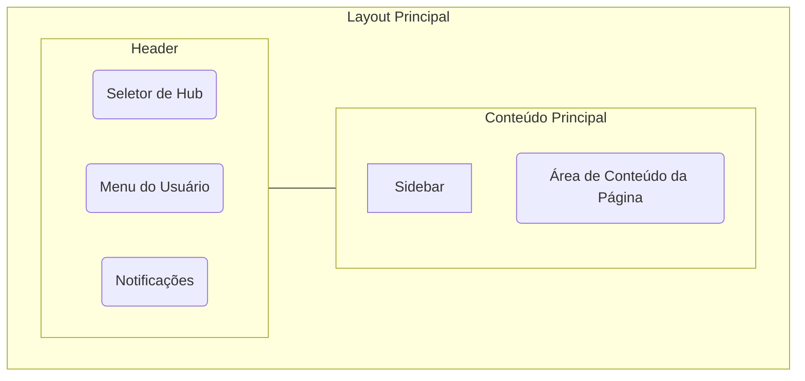

# Visão Geral da Aplicação e Guia de Experiência do Usuário (UX)

**Documento Principal:** Este documento serve como a fonte central da verdade para a estrutura de layout, navegação e a experiência do usuário (UX) em toda a aplicação ExpenseHub. Ele deve ser o ponto de partida para qualquer desenvolvedor que trabalhe no frontend.

## 1. O Layout Principal (App Shell)

A aplicação utiliza um layout "App Shell" consistente para fornecer uma experiência de usuário familiar e previsível. Ele é dividido em três componentes principais: a **Sidebar** para navegação, o **Header** para ações globais e o **Content Area** onde o conteúdo da página é renderizado.

### 1.1. Sidebar (Navegação Principal)

A `Sidebar` é persistente em todas as páginas após o login e serve como o principal meio de navegação.

-   **Dashboard:** A página inicial com uma visão geral das finanças.
-   **Transações:** A página para visualizar, adicionar, editar e excluir transações.
-   **Relatórios:** A página para análises financeiras mais detalhadas.
-   **Membros:** A página para gerenciar membros do Hub.
-   **Configurações:** A página para configurações do Hub e do usuário.

### 1.2. Header (Ações Globais)

O `Header` contém funcionalidades que são relevantes em todo o aplicativo.

-   **Seletor de Hub:** Um `Combobox` que permite ao usuário alternar entre os diferentes Hubs dos quais faz parte.
-   **Menu do Usuário:** Um `Dropdown` com links para "Meu Perfil" e a ação de "Sair".
-   **Notificações:** Um ícone de sino que, quando clicado, abre um `Popover` com as notificações recentes do usuário.

## 2. A Jornada do Novo Usuário (Onboarding)

A primeira experiência de um usuário é crucial. O objetivo é guiá-lo para o "momento aha!" o mais rápido possível, mostrando o valor do ExpenseHub.

### 2.1. Fluxo de Primeiro Login e Checklist de Onboarding

Após o primeiro login, em vez de um dashboard vazio e confuso, o usuário será recebido com um modal de boas-vindas e um "Checklist de Onboarding".

1.  **Criação do Primeiro Hub:** O sistema já terá criado um "Hub Pessoal" para o usuário.
2.  **Convite para o Checklist:** Um modal de boas-vindas apresentará o checklist.
3.  **Checklist Interativo:** O checklist guiará o usuário pelas ações essenciais:
    -   [ ] **Cadastre sua primeira categoria de gasto:** (Ex: "Alimentação") - Leva o usuário à criação de uma Tag.
    -   [ ] **Crie sua primeira transação:** - Leva o usuário ao formulário de transação, pré-preenchido se possível.
    -   [ ] **Convide um membro para o seu Hub:** - Leva o usuário à página de gerenciamento de membros.

### 2.2. "Empty States" Inteligentes

"Empty states" não são erros; são oportunidades. Cada página principal deve ter um estado vazio bem projetado que educa o usuário e o incentiva à ação.

-   **Dashboard Vazio:**
    -   **Mensagem:** "Seu painel está pronto! Comece adicionando sua primeira transação para ver a mágica acontecer."
    -   **Botão CTA Primário:** "Adicionar Nova Transação"
-   **Página de Transações Vazia:**
    -   **Mensagem:** "Nenhuma transação encontrada. Que tal registrar seu primeiro gasto ou ganho?"
    -   **Botão CTA Primário:** "Registrar Transação"
    -   **Ação Secundária:** "Importar Extrato (em breve)"
-   **Página de Relatórios Vazia:**
    -   **Mensagem:** "Os relatórios ganharão vida assim que você tiver dados de transações. Continue registrando seus gastos!"
    -   **Botão CTA Primário:** "Ir para Transações"

## 3. Sistema de Notificações

Um sistema de notificações simples manterá os usuários engajados e informados sobre atividades importantes.

### 3.1. Gatilhos de Notificação

As seguintes ações devem gerar uma notificação:

-   Você foi convidado para um novo Hub.
-   Seu convite para um Hub foi aceito.
-   Uma nova transação foi criada e você é um participante.
-   Uma transação em que você é participante foi atualizada ou excluída.
-   Você foi removido de um Hub.

### 3.2. Interface de Notificações

-   **Ícone no Header:** Um ícone de sino no `Header` indicará a presença de notificações não lidas.
-   **Dropdown/Popover:** Ao clicar no sino, um `Popover` será aberto, listando as notificações mais recentes.
    -   Cada notificação terá uma mensagem clara e um link para a página relevante (se aplicável).
    -   Haverá uma ação para "Marcar todas como lidas". 