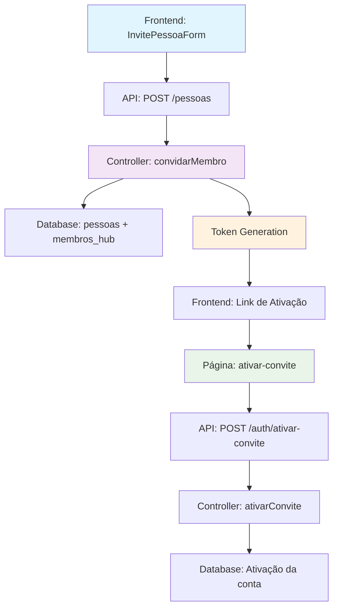
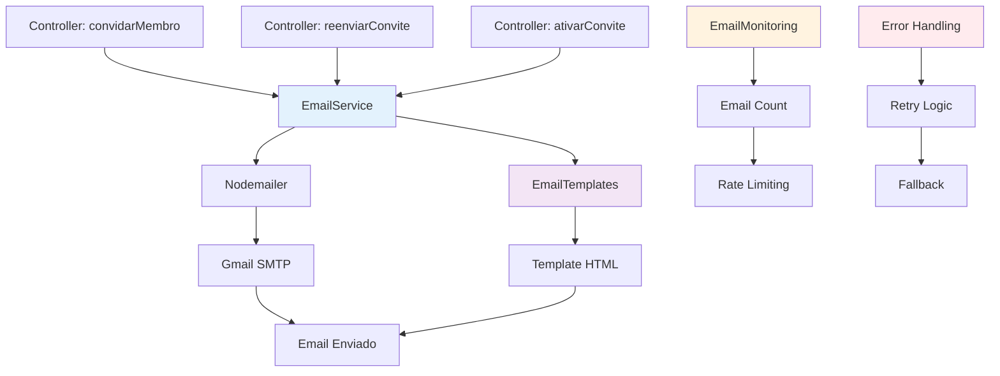

# 📧 DOCUMENTAÇÃO TÉCNICA: IMPLEMENTAÇÃO DO SISTEMA DE EMAIL COM GMAIL SMTP

**Data da Documentação**: 2025-01-27  
**Módulo**: Sistema de Convites com Email  
**Tecnologia**: Gmail SMTP + Nodemailer  
**Versão**: 2.0 (CORRIGIDA)  
**Responsável**: AI Assistant  

---

## 🎯 RESUMO EXECUTIVO

### Objetivo
Implementar sistema de envio de emails automático para convites de membros usando Gmail SMTP, integrado ao sistema de convites existente do Expense Hub.

### Escopo
- Sistema de email para convites de novos membros
- Reenvio de convites expirados
- Templates de email personalizados
- Monitoramento de limites do Gmail (500 emails/dia)
- Integração com controllers existentes
- Tratamento robusto de erros e fallbacks

### Impacto Esperado
- **Usuários**: Recebem convites automaticamente por email
- **Sistema**: Fluxo completo de convites funcionando
- **Experiência**: Processo de onboarding simplificado
- **Confiabilidade**: Sistema resiliente com monitoramento

---

## 1. 🔍 ANÁLISE INICIAL DO ESTADO ATUAL

### 1.1 Arquitetura Atual do Sistema de Convites



### 1.2 Componentes Existentes

#### Backend
- ✅ **Controllers**: `pessoaController.ts` (convidarMembro, reenviarConvite)
- ✅ **Routes**: `/pessoas` (POST, PUT, DELETE)
- ✅ **Schemas**: Validação Zod para convites
- ✅ **Database**: Tabelas `pessoas` e `membros_hub`
- ❌ **Email Service**: Não implementado

#### Frontend
- ✅ **Formulário**: `InvitePessoaForm.tsx`
- ✅ **Página**: `membros/page.tsx`
- ✅ **Ativação**: `ativar-convite/page.tsx`
- ✅ **Hooks**: `usePessoas.ts` (useInvitePessoa)
- ❌ **Email Templates**: Não implementado

### 1.3 Tecnologias e Dependências Atuais

| Tecnologia | Versão | Status | Propósito |
|------------|--------|--------|-----------|
| Node.js | 18+ | ✅ Ativo | Runtime |
| Express | 4.21.1 | ✅ Ativo | Web Framework |
| Prisma | 6.12.0 | ✅ Ativo | ORM |
| Zod | 3.25.67 | ✅ Ativo | Validação |
| TypeScript | 5.8.3 | ✅ Ativo | Linguagem |
| React | 18+ | ✅ Ativo | Frontend |
| Next.js | 14+ | ✅ Ativo | Framework Frontend |

---

## 2. 🔗 ANÁLISE DE IMPACTO E DEPENDÊNCIAS

### 2.1 Pontos de Impacto Identificados

#### 2.1.1 Backend - Modificações Necessárias
```typescript
// Arquivos a serem modificados:
backend/
├── controllers/
│   ├── pessoaController.ts     // Adicionar envio de email
│   └── authController.ts       // Adicionar envio de email
├── services/                   // NOVO: Criar pasta
│   ├── emailService.ts         // NOVO: Serviço de email
│   ├── emailTemplates.ts       // NOVO: Templates HTML
│   └── emailMonitoring.ts      // NOVO: Monitoramento de limites
├── utils/
│   └── emailUtils.ts           // NOVO: Utilitários de email
├── types/
│   └── email.ts                // NOVO: Tipos TypeScript
├── package.json               // Adicionar nodemailer
└── .env                       // Adicionar credenciais Gmail
```

#### 2.1.2 Frontend - Modificações Necessárias
```typescript
// Arquivos a serem modificados:
frontend/
├── components/
│   └── pessoas/
│       └── InvitePessoaForm.tsx  // Atualizar mensagens
├── hooks/
│   └── usePessoas.ts             // Atualizar feedback
└── lib/
    └── constants.ts              // Adicionar constantes de email
```

### 2.2 Dependências Novas

#### 2.2.1 Backend Dependencies
```json
{
  "dependencies": {
    "nodemailer": "^6.9.7",
    "@types/nodemailer": "^6.4.14"
  },
  "devDependencies": {
    "jest": "^29.7.0",
    "@types/jest": "^29.5.8"
  },
  "scripts": {
    "test:email": "jest --testPathPattern=email",
    "test:email:watch": "jest --testPathPattern=email --watch"
  }
}
```

#### 2.2.2 Variáveis de Ambiente
```env
# Email Configuration
GMAIL_USER=seu-email@gmail.com
GMAIL_APP_PASSWORD=sua-senha-de-aplicativo
EMAIL_FROM_NAME=Expense Hub
FRONTEND_URL=http://localhost:3000
ENABLE_EMAILS=true
EMAIL_RETRY_ATTEMPTS=3
EMAIL_RETRY_DELAY=1000
EMAIL_DAILY_LIMIT=450
EMAIL_HOURLY_LIMIT=90
```

### 2.3 Conflitos Potenciais

| Conflito | Probabilidade | Impacto | Mitigação |
|----------|---------------|---------|-----------|
| Rate Limiting Gmail | Alta | Médio | Monitoramento + fallback |
| Credenciais Expiradas | Média | Alto | Validação + fallback |
| Templates HTML | Baixa | Baixo | Validação de templates |
| Dependências | Baixa | Baixo | Testes de compatibilidade |
| 2FA Gmail | Média | Alto | Configuração de App Password |

---

## 3. 🛠️ PLANO DE IMPLEMENTAÇÃO DETALHADO

### 3.1 Arquitetura da Solução



#### 3.1.1 Padrões de Design
- **Service Layer**: EmailService isolado e reutilizável
- **Template Pattern**: Templates HTML separados da lógica
- **Singleton**: Uma instância do transporter
- **Error Handling**: Tratamento robusto de erros com retry
- **Monitoring**: Controle de limites do Gmail
- **Retry Pattern**: Tentativas automáticas em caso de falha

#### 3.1.2 Estrutura de Pastas
```
backend/
├── services/
│   ├── emailService.ts         # Serviço principal de email
│   ├── emailTemplates.ts       # Templates HTML
│   └── emailMonitoring.ts      # Monitoramento de limites
├── utils/
│   └── emailUtils.ts           # Utilitários de email
└── types/
    └── email.ts                # Tipos TypeScript
```

### 3.2 Modificações Necessárias

#### 3.2.1 Novos Arquivos a Criar

**1. `backend/types/email.ts`**
```typescript
export interface EmailData {
  to: string;
  nome: string;
  hubNome: string;
  conviteToken: string;
  convidadorNome: string;
}

export interface EmailResult {
  success: boolean;
  messageId?: string;
  error?: string;
  retryCount?: number;
}

export interface EmailConfig {
  host: string;
  port: number;
  secure: boolean;
  auth: {
    user: string;
    pass: string;
  };
  pool: boolean;
  maxConnections: number;
  maxMessages: number;
  rateLimit: number;
}

export interface EmailMonitoringData {
  emailCount: number;
  lastReset: Date;
  dailyLimit: number;
  hourlyLimit: number;
}
```

**2. `backend/utils/emailUtils.ts`**
```typescript
import { EmailData } from '../types/email';

export class EmailUtils {
  /**
   * Valida se um email é válido
   */
  static validateEmail(email: string): boolean {
    const emailRegex = /^[^\s@]+@[^\s@]+\.[^\s@]+$/;
    return emailRegex.test(email);
  }

  /**
   * Sanitiza dados para evitar XSS em templates
   */
  static sanitizeHtml(text: string): string {
    return text
      .replace(/&/g, '&amp;')
      .replace(/</g, '&lt;')
      .replace(/>/g, '&gt;')
      .replace(/"/g, '&quot;')
      .replace(/'/g, '&#x27;');
  }

  /**
   * Gera link de ativação
   */
  static generateActivationLink(token: string, frontendUrl: string): string {
    return `${frontendUrl}/ativar-convite?token=${encodeURIComponent(token)}`;
  }

  /**
   * Formata data para exibição
   */
  static formatDate(date: Date): string {
    return date.toLocaleDateString('pt-BR', {
      day: '2-digit',
      month: '2-digit',
      year: 'numeric',
      hour: '2-digit',
      minute: '2-digit'
    });
  }

  /**
   * Valida dados de email antes do envio
   */
  static validateEmailData(data: EmailData): { isValid: boolean; errors: string[] } {
    const errors: string[] = [];

    if (!this.validateEmail(data.to)) {
      errors.push('Email inválido');
    }

    if (!data.nome || data.nome.trim().length < 2) {
      errors.push('Nome deve ter pelo menos 2 caracteres');
    }

    if (!data.hubNome || data.hubNome.trim().length < 2) {
      errors.push('Nome do Hub deve ter pelo menos 2 caracteres');
    }

    if (!data.conviteToken || data.conviteToken.trim().length < 10) {
      errors.push('Token de convite inválido');
    }

    if (!data.convidadorNome || data.convidadorNome.trim().length < 2) {
      errors.push('Nome do convidador deve ter pelo menos 2 caracteres');
    }

    return {
      isValid: errors.length === 0,
      errors
    };
  }
}
```

**3. `backend/services/emailMonitoring.ts`**
```typescript
import { EmailMonitoringData } from '../types/email';

export class EmailMonitoring {
  private emailCount = 0;
  private lastReset = new Date();
  private dailyLimit: number;
  private hourlyLimit: number;
  private hourlyCount = 0;
  private lastHourReset = new Date();

  constructor() {
    this.dailyLimit = parseInt(process.env.EMAIL_DAILY_LIMIT || '450');
    this.hourlyLimit = parseInt(process.env.EMAIL_HOURLY_LIMIT || '90');
  }

  /**
   * Verifica se pode enviar mais emails
   */
  checkLimits(): { canSend: boolean; reason?: string } {
    const now = new Date();
    
    // Reset contador diário
    if (now.getDate() !== this.lastReset.getDate() || 
        now.getMonth() !== this.lastReset.getMonth() || 
        now.getFullYear() !== this.lastReset.getFullYear()) {
      this.emailCount = 0;
      this.lastReset = now;
    }

    // Reset contador horário
    if (now.getHours() !== this.lastHourReset.getHours() || 
        now.getDate() !== this.lastHourReset.getDate()) {
      this.hourlyCount = 0;
      this.lastHourReset = now;
    }

    // Verificar limite diário
    if (this.emailCount >= this.dailyLimit) {
      return { 
        canSend: false, 
        reason: `Limite diário atingido (${this.emailCount}/${this.dailyLimit})` 
      };
    }

    // Verificar limite horário
    if (this.hourlyCount >= this.hourlyLimit) {
      return { 
        canSend: false, 
        reason: `Limite horário atingido (${this.hourlyCount}/${this.hourlyLimit})` 
      };
    }

    return { canSend: true };
  }

  /**
   * Incrementa contadores após envio
   */
  incrementCount(): void {
    this.emailCount++;
    this.hourlyCount++;
  }

  /**
   * Retorna dados de monitoramento
   */
  getMonitoringData(): EmailMonitoringData {
    return {
      emailCount: this.emailCount,
      lastReset: this.lastReset,
      dailyLimit: this.dailyLimit,
      hourlyLimit: this.hourlyLimit
    };
  }

  /**
   * Log de uso para monitoramento
   */
  logUsage(): void {
    const data = this.getMonitoringData();
    console.log(`📧 Emails enviados hoje: ${data.emailCount}/${data.dailyLimit}`);
    console.log(`📧 Emails enviados nesta hora: ${this.hourlyCount}/${data.hourlyLimit}`);
    
    if (data.emailCount > this.dailyLimit * 0.8) {
      console.warn('⚠️ ATENÇÃO: Limite diário próximo de ser atingido');
    }
    
    if (this.hourlyCount > this.hourlyLimit * 0.8) {
      console.warn('⚠️ ATENÇÃO: Limite horário próximo de ser atingido');
    }
  }

  /**
   * Reseta contadores (para testes)
   */
  resetCounters(): void {
    this.emailCount = 0;
    this.hourlyCount = 0;
    this.lastReset = new Date();
    this.lastHourReset = new Date();
  }
}
```

---

**CONTINUA NA PARTE 2...** 