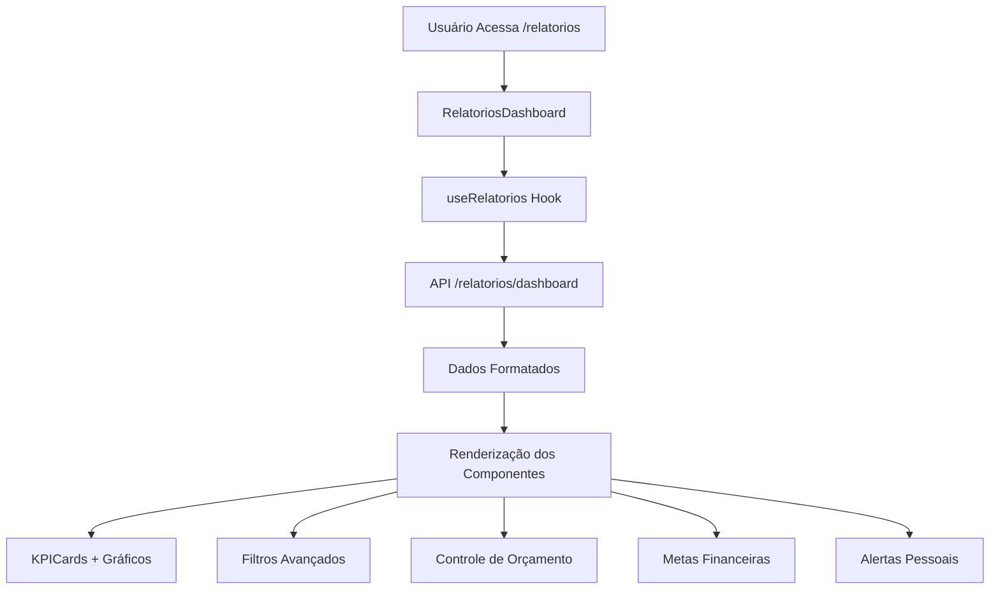
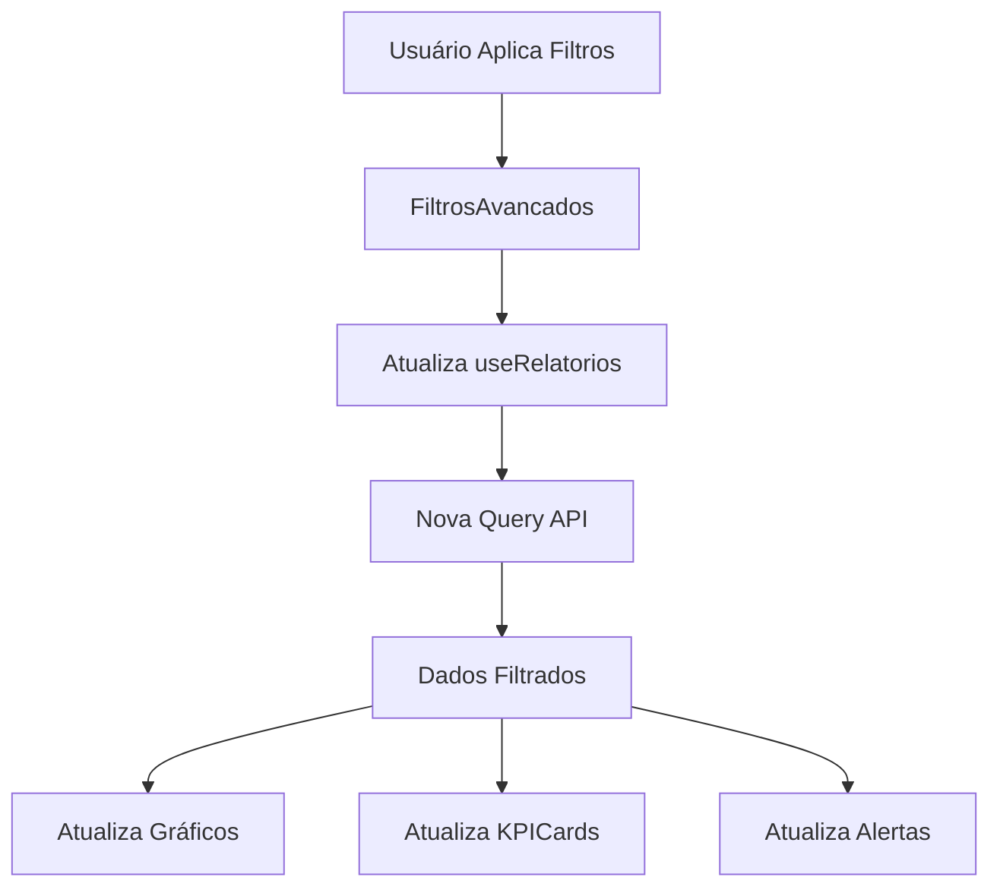
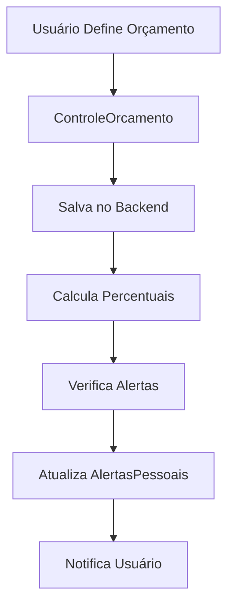

# 📊 MELHORIAS CRÍTICAS - MÓDULO DE RELATÓRIOS
## Documentação de Implementação Técnica

**Data**: 2025-01-27  
**Versão**: 1.0.0  
**Status**: Documentação Técnica  
**Módulo**: Relatórios - Expense Hub  

---

## 🎯 VISÃO GERAL

### Objetivo
Implementar as 5 melhorias críticas para transformar o módulo de relatórios de um placeholder básico em uma interface completa e funcional para controle financeiro pessoal.

### Contexto Atual
- **Backend**: APIs de relatórios já implementadas e funcionais
- **Frontend**: Apenas placeholder básico (`/relatorios`)
- **Componentes**: Sistema visual maduro com shadcn/ui, gradientes, glassmorphism
- **Padrão**: Dashboard já implementado com KPICards, gráficos e hooks customizados

### Melhorias Críticas Identificadas
1. **Interface Frontend Completa** - Dashboard moderno e intuitivo
2. **Gráficos e Visualizações Pessoais** - Análise visual de padrões de gastos
3. **Sistema de Orçamento Pessoal** - Controle de limites por categoria
4. **Metas Financeiras Pessoais** - Acompanhamento de objetivos
5. **Alertas de Gastos Excessivos** - Notificações proativas

---

## 🏗️ ARQUITETURA

### Estrutura de Arquivos
```
frontend/src/
├── app/(auth)/relatorios/
│   ├── page.tsx                    # Página principal de relatórios
│   ├── orcamento/
│   │   └── page.tsx               # Página de orçamento
│   └── metas/
│       └── page.tsx               # Página de metas
├── components/relatorios/
│   ├── RelatoriosDashboard.tsx    # Dashboard principal
│   ├── GraficosRelatorios.tsx     # Componente de gráficos
│   ├── FiltrosAvancados.tsx       # Sistema de filtros
│   ├── ControleOrcamento.tsx      # Controle de orçamento
│   ├── MetasFinanceiras.tsx       # Sistema de metas
│   ├── AlertasPessoais.tsx        # Sistema de alertas
│   └── ExportacaoRelatorios.tsx   # Exportação de dados
├── hooks/
│   └── useRelatorios.ts           # Hook customizado para relatórios
└── lib/
    └── relatorios.ts              # Utilitários para relatórios
```

### Fluxo de Dados
```
[Usuário] → [RelatoriosDashboard] → [useRelatorios] → [API Backend]
                    ↓
[Componentes Específicos] → [Hooks Especializados] → [Dados Formatados]
                    ↓
[Gráficos/Alertas] → [Filtros] → [Exportação]
```

### Integração com Sistema Existente
- **Reutilização**: KPICard, MetricIcon, MetricBadge do dashboard
- **Padrão Visual**: Gradientes, glassmorphism, animações framer-motion
- **Hooks**: Extensão do useDashboard para relatórios específicos
- **APIs**: Utilização das rotas `/api/relatorios/*` existentes
---

## 🧩 COMPONENTES

### 1. RelatoriosDashboard.tsx
**Propósito**: Dashboard principal com visão geral dos relatórios

```typescript
interface RelatoriosDashboardProps {
  periodo?: PeriodoTipo;
  dataInicio?: string;
  dataFim?: string;
  categoria?: string;
  pessoa?: string;
}

// Estrutura do componente
<RelatoriosDashboard>
  <FiltrosAvancados />
  <div className="grid grid-cols-1 md:grid-cols-2 lg:grid-cols-4 gap-6">
    <KPICard type="expense" title="Total Gastos" />
    <KPICard type="revenue" title="Total Receitas" />
    <KPICard type="balance" title="Saldo" />
    <KPICard type="pending" title="Pendências" />
  </div>
  <GraficosRelatorios />
  <ControleOrcamento />
  <MetasFinanceiras />
  <AlertasPessoais />
</RelatoriosDashboard>
```

### 2. GraficosRelatorios.tsx
**Propósito**: Visualizações interativas de dados financeiros

```typescript
interface GraficosRelatoriosProps {
  data: {
    gastosPorCategoria: GastoPorCategoria[];
    gastosPorDia: GastoPorDia[];
    evolucaoMensal: EvolucaoMensal[];
    comparacaoPeriodos: ComparacaoPeriodos;
  };
  loading?: boolean;
}

// Tipos de gráficos implementados
- Gráfico de Pizza: Gastos por categoria
- Gráfico de Linha: Evolução temporal
- Gráfico de Barras: Comparação entre períodos
- Gráfico de Área: Tendências de gastos
```

### 3. FiltrosAvancados.tsx
**Propósito**: Sistema de filtros complexos e salvos

```typescript
interface FiltrosAvancadosProps {
  filtros: FiltroRelatorio;
  onFiltrosChange: (filtros: FiltroRelatorio) => void;
  filtrosSalvos?: FiltroSalvo[];
  onSalvarFiltro?: (nome: string, filtros: FiltroRelatorio) => void;
}

interface FiltroRelatorio {
  periodo: PeriodoTipo;
  dataInicio?: string;
  dataFim?: string;
  categorias: string[];
  pessoas: string[];
  valorMinimo?: number;
  valorMaximo?: number;
  status: 'TODOS' | 'CONFIRMADO' | 'PENDENTE';
  ordenacao: {
    campo: 'data' | 'valor' | 'categoria' | 'pessoa';
    direcao: 'asc' | 'desc';
  };
}
```

### 4. ControleOrcamento.tsx
**Propósito**: Sistema de orçamento pessoal por categoria

```typescript
interface ControleOrcamentoProps {
  orcamentos: OrcamentoCategoria[];
  gastos: GastoPorCategoria[];
  onDefinirOrcamento: (categoria: string, valor: number) => void;
  onAjustarOrcamento: (categoria: string, valor: number) => void;
}

interface OrcamentoCategoria {
  categoria: string;
  limite: number;
  gasto: number;
  percentual: number;
  status: 'dentro' | 'proximo' | 'excedido';
  alertas: AlertaOrcamento[];
}
```

### 5. MetasFinanceiras.tsx
**Propósito**: Sistema de metas e objetivos financeiros

```typescript
interface MetasFinanceirasProps {
  metas: MetaFinanceira[];
  progresso: ProgressoMeta[];
  onCriarMeta: (meta: NovaMeta) => void;
  onAtualizarMeta: (id: number, dados: Partial<MetaFinanceira>) => void;
}

interface MetaFinanceira {
  id: number;
  titulo: string;
  tipo: 'economia' | 'reducao_gastos' | 'objetivo_especifico';
  valorObjetivo: number;
  valorAtual: number;
  dataInicio: string;
  dataFim: string;
  categoria?: string;
  status: 'ativa' | 'concluida' | 'atrasada';
  progresso: number; // 0-100
}
```

### 6. AlertasPessoais.tsx
**Propósito**: Sistema de alertas e notificações proativas

```typescript
interface AlertasPessoaisProps {
  alertas: AlertaPessoal[];
  configuracoes: ConfiguracaoAlertas;
  onConfigurarAlerta: (config: ConfiguracaoAlerta) => void;
  onDismissAlerta: (id: number) => void;
}

interface AlertaPessoal {
  id: number;
  tipo: 'orcamento_excedido' | 'gasto_acima_media' | 'meta_atrasada' | 'vencimento_proximo';
  titulo: string;
  mensagem: string;
  severidade: 'baixa' | 'media' | 'alta';
  data: string;
  acao?: string;
  lida: boolean;
}
```

### 7. ExportacaoRelatorios.tsx
**Propósito**: Exportação de dados em diferentes formatos

```typescript
interface ExportacaoRelatoriosProps {
  dados: DadosRelatorio;
  filtros: FiltroRelatorio;
  onExportar: (formato: 'pdf' | 'excel' | 'csv') => void;
}

// Formatos suportados
- PDF: Relatório formatado com gráficos
- Excel: Dados tabulares com múltiplas abas
- CSV: Dados brutos para análise externa
```
---

## 🔄 FLUXOS

### Fluxo Principal de Relatórios


### Fluxo de Filtros


### Fluxo de Orçamento


---

## 🛠️ IMPLEMENTAÇÃO

### Fase 1: Estrutura Base (Semana 1)

#### 1.1 Criar Hook useRelatorios
```typescript
// frontend/src/hooks/useRelatorios.ts
import { useQuery } from '@tanstack/react-query';
import { api } from '@/lib/api';

export function useRelatorios(params: RelatoriosParams = {}) {
  const { accessToken, hubAtual } = useAuth();

  return useQuery<RelatoriosData>({
    queryKey: ['relatorios', hubAtual?.id, params],
    queryFn: async () => {
      const response = await api.get('/relatorios/dashboard', { params });
      return response.data.data;
    },
    enabled: !!accessToken && !!hubAtual?.id,
  });
}
```

#### 1.2 Criar Página Principal
```typescript
// frontend/src/app/(auth)/relatorios/page.tsx
'use client';

import { RelatoriosDashboard } from '@/components/relatorios/RelatoriosDashboard';

export default function RelatoriosPage() {
  return (
    <div className="container mx-auto p-6 space-y-6">
      <div className="flex items-center justify-between">
        <div>
          <h1 className="text-3xl font-bold text-gray-900">Relatórios</h1>
          <p className="text-gray-600">Análise completa das suas finanças</p>
        </div>
      </div>
      <RelatoriosDashboard />
    </div>
  );
}
```

#### 1.3 Criar Componente Dashboard
```typescript
// frontend/src/components/relatorios/RelatoriosDashboard.tsx
'use client';

import { useState } from 'react';
import { useRelatorios } from '@/hooks/useRelatorios';
import { KPICard } from '@/components/dashboard/KPICard';
import { FiltrosAvancados } from './FiltrosAvancados';
import { GraficosRelatorios } from './GraficosRelatorios';

export function RelatoriosDashboard() {
  const [filtros, setFiltros] = useState<FiltroRelatorio>({
    periodo: '30_dias',
    categorias: [],
    pessoas: [],
    status: 'TODOS',
    ordenacao: { campo: 'data', direcao: 'desc' }
  });

  const { data, isLoading } = useRelatorios(filtros);

  return (
    <div className="space-y-6">
      <FiltrosAvancados 
        filtros={filtros} 
        onFiltrosChange={setFiltros} 
      />
      
      <div className="grid grid-cols-1 md:grid-cols-2 lg:grid-cols-4 gap-6">
        <KPICard
          title="Total Gastos"
          value={data?.resumo.total_gastos || 0}
          type="expense"
          loading={isLoading}
        />
        <KPICard
          title="Total Receitas"
          value={data?.resumo.total_receitas || 0}
          type="revenue"
          loading={isLoading}
        />
        <KPICard
          title="Saldo"
          value={data?.resumo.saldo_periodo || 0}
          type="balance"
          loading={isLoading}
        />
        <KPICard
          title="Pendências"
          value={data?.resumo.transacoes_pendentes || 0}
          type="pending"
          loading={isLoading}
        />
      </div>

      <GraficosRelatorios data={data?.graficos} loading={isLoading} />
    </div>
  );
}
```

### Fase 2: Gráficos e Visualizações (Semana 2)

#### 2.1 Extender GraficosRelatorios
```typescript
// frontend/src/components/relatorios/GraficosRelatorios.tsx
'use client';

import { Card, CardContent, CardHeader, CardTitle } from '@/components/ui/card';
import { Tabs, TabsContent, TabsList, TabsTrigger } from '@/components/ui/tabs';
import { GraficoGastosPorCategoria } from '@/components/dashboard/GraficoGastosPorCategoria';
import { GraficoGastosPorDia } from '@/components/dashboard/GraficoGastosPorDia';

export function GraficosRelatorios({ data, loading }) {
  return (
    <Card>
      <CardHeader>
        <CardTitle>Análise Visual</CardTitle>
      </CardHeader>
      <CardContent>
        <Tabs defaultValue="categorias" className="w-full">
          <TabsList>
            <TabsTrigger value="categorias">Por Categoria</TabsTrigger>
            <TabsTrigger value="temporal">Evolução Temporal</TabsTrigger>
            <TabsTrigger value="comparacao">Comparação</TabsTrigger>
          </TabsList>
          
          <TabsContent value="categorias">
            <GraficoGastosPorCategoria 
              data={data?.gastosPorCategoria || []} 
              loading={loading} 
            />
          </TabsContent>
          
          <TabsContent value="temporal">
            <GraficoGastosPorDia 
              data={data?.gastosPorDia || []} 
              loading={loading} 
            />
          </TabsContent>
          
          <TabsContent value="comparacao">
            {/* Novo componente de comparação */}
          </TabsContent>
        </Tabs>
      </CardContent>
    </Card>
  );
}
```

### Fase 3: Sistema de Orçamento (Semana 3)

#### 3.1 Criar ControleOrcamento
```typescript
// frontend/src/components/relatorios/ControleOrcamento.tsx
'use client';

import { useState } from 'react';
import { Card, CardContent, CardHeader, CardTitle } from '@/components/ui/card';
import { Progress } from '@/components/ui/progress';
import { Button } from '@/components/ui/button';
import { Dialog, DialogContent, DialogHeader, DialogTitle, DialogTrigger } from '@/components/ui/dialog';
import { Input } from '@/components/ui/input';
import { Label } from '@/components/ui/label';

export function ControleOrcamento({ orcamentos, gastos, onDefinirOrcamento }) {
  const [openDialog, setOpenDialog] = useState(false);
  const [categoriaSelecionada, setCategoriaSelecionada] = useState('');

  return (
    <Card>
      <CardHeader>
        <div className="flex items-center justify-between">
          <CardTitle>Controle de Orçamento</CardTitle>
          <Button onClick={() => setOpenDialog(true)}>
            Definir Orçamento
          </Button>
        </div>
      </CardHeader>
      <CardContent>
        <div className="space-y-4">
          {orcamentos.map((orcamento) => (
            <div key={orcamento.categoria} className="space-y-2">
              <div className="flex items-center justify-between">
                <span className="font-medium">{orcamento.categoria}</span>
                <span className="text-sm text-gray-600">
                  R$ {orcamento.gasto.toFixed(2)} / R$ {orcamento.limite.toFixed(2)}
                </span>
              </div>
              <Progress 
                value={orcamento.percentual} 
                className={orcamento.status === 'excedido' ? 'bg-red-100' : ''}
              />
              {orcamento.status === 'excedido' && (
                <p className="text-sm text-red-600">
                  Orçamento excedido em R$ {(orcamento.gasto - orcamento.limite).toFixed(2)}
                </p>
              )}
            </div>
          ))}
        </div>
      </CardContent>
    </Card>
  );
}
```

### Fase 4: Metas Financeiras (Semana 4)

#### 4.1 Criar MetasFinanceiras
```typescript
// frontend/src/components/relatorios/MetasFinanceiras.tsx
'use client';

import { Card, CardContent, CardHeader, CardTitle } from '@/components/ui/card';
import { Progress } from '@/components/ui/progress';
import { Badge } from '@/components/ui/badge';
import { Button } from '@/components/ui/button';

export function MetasFinanceiras({ metas, progresso, onCriarMeta }) {
  return (
    <Card>
      <CardHeader>
        <div className="flex items-center justify-between">
          <CardTitle>Metas Financeiras</CardTitle>
          <Button onClick={() => onCriarMeta()}>
            Nova Meta
          </Button>
        </div>
      </CardHeader>
      <CardContent>
        <div className="space-y-6">
          {metas.map((meta) => (
            <div key={meta.id} className="space-y-3">
              <div className="flex items-center justify-between">
                <div>
                  <h4 className="font-medium">{meta.titulo}</h4>
                  <p className="text-sm text-gray-600">
                    R$ {meta.valorAtual.toFixed(2)} / R$ {meta.valorObjetivo.toFixed(2)}
                  </p>
                </div>
                <Badge variant={meta.status === 'concluida' ? 'default' : 'secondary'}>
                  {meta.status}
                </Badge>
              </div>
              <Progress value={meta.progresso} />
              <div className="text-sm text-gray-500">
                {meta.progresso.toFixed(1)}% concluído
              </div>
            </div>
          ))}
        </div>
      </CardContent>
    </Card>
  );
}
```

### Fase 5: Alertas Pessoais (Semana 5)

#### 5.1 Criar AlertasPessoais
```typescript
// frontend/src/components/relatorios/AlertasPessoais.tsx
'use client';

import { Card, CardContent, CardHeader, CardTitle } from '@/components/ui/card';
import { Badge } from '@/components/ui/badge';
import { Button } from '@/components/ui/button';
import { AlertTriangle, CheckCircle, Info } from 'lucide-react';

export function AlertasPessoais({ alertas, onDismissAlerta }) {
  const getSeverityIcon = (severidade: string) => {
    switch (severidade) {
      case 'alta': return <AlertTriangle className="h-4 w-4 text-red-500" />;
      case 'media': return <Info className="h-4 w-4 text-yellow-500" />;
      case 'baixa': return <CheckCircle className="h-4 w-4 text-green-500" />;
    }
  };

  return (
    <Card>
      <CardHeader>
        <CardTitle>Alertas e Notificações</CardTitle>
      </CardHeader>
      <CardContent>
        <div className="space-y-4">
          {alertas.map((alerta) => (
            <div 
              key={alerta.id} 
              className={`p-4 rounded-lg border ${
                alerta.severidade === 'alta' ? 'border-red-200 bg-red-50' :
                alerta.severidade === 'media' ? 'border-yellow-200 bg-yellow-50' :
                'border-green-200 bg-green-50'
              }`}
            >
              <div className="flex items-start justify-between">
                <div className="flex items-start gap-3">
                  {getSeverityIcon(alerta.severidade)}
                  <div>
                    <h4 className="font-medium">{alerta.titulo}</h4>
                    <p className="text-sm text-gray-600">{alerta.mensagem}</p>
                    <p className="text-xs text-gray-500 mt-1">{alerta.data}</p>
                  </div>
                </div>
                <Button 
                  variant="ghost" 
                  size="sm"
                  onClick={() => onDismissAlerta(alerta.id)}
                >
                  Dismiss
                </Button>
              </div>
            </div>
          ))}
        </div>
      </CardContent>
    </Card>
  );
}
```

---

## ✅ VALIDAÇÃO

### Checklist de Implementação
- [ ] **Estrutura Base**
  - [ ] Hook useRelatorios criado e funcionando
  - [ ] Página principal renderizando corretamente
  - [ ] Componente RelatoriosDashboard implementado
  - [ ] Integração com APIs existentes

- [ ] **Gráficos e Visualizações**
  - [ ] Gráficos reutilizando componentes existentes
  - [ ] Tabs funcionando corretamente
  - [ ] Dados sendo exibidos nos gráficos
  - [ ] Responsividade em diferentes telas

- [ ] **Sistema de Orçamento**
  - [ ] Interface para definir orçamentos
  - [ ] Cálculo de percentuais funcionando
  - [ ] Alertas de excedimento
  - [ ] Persistência no backend

- [ ] **Metas Financeiras**
  - [ ] Criação de metas funcionando
  - [ ] Cálculo de progresso
  - [ ] Status das metas atualizando
  - [ ] Interface responsiva

- [ ] **Alertas Pessoais**
  - [ ] Sistema de alertas funcionando
  - [ ] Diferentes níveis de severidade
  - [ ] Dismiss de alertas
  - [ ] Notificações em tempo real

### Testes de Funcionalidade
```bash
# Testar APIs de relatórios
curl -H "Authorization: Bearer TOKEN" \
  http://localhost:3001/api/relatorios/dashboard

# Testar filtros
curl -H "Authorization: Bearer TOKEN" \
  "http://localhost:3001/api/relatorios/dashboard?periodo=30_dias&incluir_graficos=true"

# Testar exportação
curl -H "Authorization: Bearer TOKEN" \
  http://localhost:3001/api/relatorios/exportar?formato=csv
```

### Métricas de Sucesso
- **Performance**: Carregamento < 2 segundos
- **Usabilidade**: Interface intuitiva e responsiva
- **Funcionalidade**: Todas as features implementadas
- **Integração**: Sem quebras no sistema existente
- **Acessibilidade**: Componentes acessíveis (shadcn/ui)

### Validação Visual
- [ ] Gradientes aplicados corretamente
- [ ] Glassmorphism funcionando
- [ ] Animações suaves (framer-motion)
- [ ] Cores contextuais (success, danger, neutral)
- [ ] Responsividade em mobile/desktop
- [ ] Dark mode funcionando

---

## 📋 PRÓXIMOS PASSOS

### Após Implementação das Melhorias Críticas
1. **Testes de Usabilidade**: Validar com usuários reais
2. **Otimizações de Performance**: Lazy loading, cache
3. **Melhorias Avançadas**: Análise preditiva, tendências
4. **Integração Mobile**: PWA, notificações push
5. **Analytics**: Tracking de uso dos relatórios

### Manutenção Contínua
- Monitoramento de performance
- Atualizações de dependências
- Feedback dos usuários
- Novas funcionalidades baseadas em uso

---

**Documento criado seguindo o padrão da aplicação e reutilizando componentes existentes. Todas as implementações mantêm a consistência visual e arquitetural do Expense Hub.**