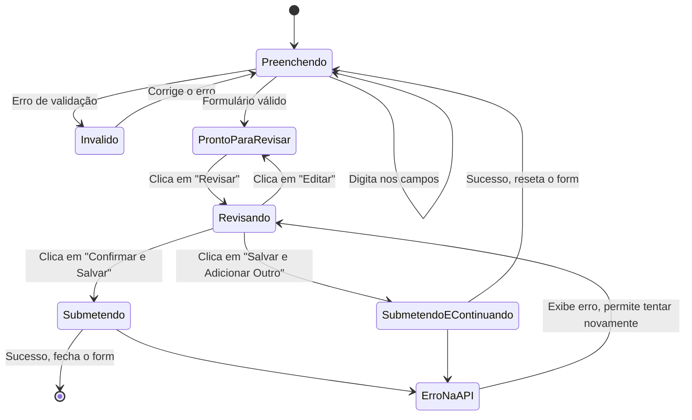

# Guia de Implementação: CRUD de Transações

## 1. Visão Geral
Este documento serve como guia completo para a implementação do frontend do módulo de transações. Ele detalha a API, as regras de negócio e as diretrizes de usabilidade para garantir uma experiência de usuário robusta e eficiente.

O módulo gerencia **gastos** e **receitas**, suportando cenários complexos como despesas compartilhadas, parcelamentos e controle de acesso baseado em papéis (RBAC).

---

## 2. Referência da API

### Endpoint Base
` /api/transacoes`

### Listar Transações
- **GET** `/`
- **Descrição:** Retorna uma lista paginada de transações. Por padrão, **retorna apenas registros ativos (`ativo: true`)**.
- **Query Params:**
  - `tipo`: `"GASTO"` ou `"RECEITA"`
  - `status_pagamento`: `"PENDENTE" | "PAGO_PARCIAL" | "PAGO_TOTAL"`
  - `data_inicio`, `data_fim`: `YYYY-MM-DD`
  - `pessoa_id`: `number` - ID de um participante.
  - `tag_id`: `number` - ID de uma tag.
  - `eh_parcelado`: `boolean`
  - `grupo_parcela`: `uuid` - Para buscar todas as parcelas de uma compra.
  - `ativo`: `boolean` - Use `ativo=false` para buscar transações na "lixeira" (soft-deleted).
  - `page`: `number` (padrão: 1)
  - `limit`: `number` (padrão: 20, máx: 100)
- **Permissões:** `PROPRIETARIO`, `ADMINISTRADOR`, `COLABORADOR`, `VISUALIZADOR`.

### Detalhar Transação
- **GET** `/:id`
- **Descrição:** Retorna os detalhes completos de uma única transação, incluindo participantes, tags, pagamentos e parcelas relacionadas (se houver).
- **Permissões:** `PROPRIETARIO`, `ADMINISTRADOR`, `COLABORADOR`, `VISUALIZADOR`.

### Criar Gasto
- **POST** `/`
- **Descrição:** Cria um novo gasto, com suporte a parcelamento.
- **Permissões:** `PROPRIETARIO`, `ADMINISTRADOR`, `COLABORADOR`.
- **Body:**
```json
{
  "descricao": "string (obrigatório, 3-200 caracteres)",
  "local": "string (opcional, até 150)",
  "valor_total": "number (obrigatório, >0)",
  "data_transacao": "YYYY-MM-DD (obrigatório)",
  "observacoes": "string (opcional, até 1000)",
  "eh_parcelado": "boolean (padrão: false)",
  "total_parcelas": "number (padrão: 1, se eh_parcelado=true)",
  "participantes": [
    { "pessoa_id": "number (obrigatório)", "valor_devido": "number (>0)" }
  ],
  "tags": ["number"]
}
```

### Criar Receita
- **POST** `/receita`
- **Descrição:** Cria uma nova receita.
- **Permissões:** Apenas `PROPRIETARIO`.
- **Body:**
```json
{
  "descricao": "string (obrigatório, 3-200 caracteres)",
  "local": "string (opcional, até 150)",
  "valor_recebido": "number (obrigatório, >0)",
  "data_transacao": "YYYY-MM-DD (obrigatório)",
  "observacoes": "string (opcional, até 1000)",
  "tags": ["number"]
}
```

### Editar Gasto
- **PUT** `/:id`
- **Descrição:** Edita campos **não financeiros** de um gasto. Não é possível alterar valores, participantes ou status de parcelamento após a criação.
- **Permissões:** `PROPRIETARIO`, `ADMINISTRADOR`, `COLABORADOR`.
- **Body:**
```json
{
  "descricao": "string (opcional, 3-200 caracteres)",
  "local": "string (opcional, até 150)",
  "observacoes": "string (opcional, até 1000)",
  "tags": ["number"]
}
```

### Editar Receita
- **PUT** `/receita/:id`
- **Descrição:** Edita campos de uma receita.
- **Permissões:** Apenas `PROPRIETARIO`.
- **Body:**
```json
{
  "descricao": "string (opcional, 3-200 caracteres)",
  "local": "string (opcional, até 150)",
  "valor_recebido": "number (opcional, >0)",
  "data_transacao": "YYYY-MM-DD (opcional)",
  "observacoes": "string (opcional, até 1000)",
  "tags": ["number"]
}
```

### Excluir Transação (Soft Delete)
- **DELETE** `/:id`
- **Descrição:** **Não apaga** o registro. Realiza um **soft delete**, marcando a transação como inativa (`ativo: false`).
- **Permissões:** `PROPRIETARIO`, `ADMINISTRADOR`.
- **Regra Crítica:** Não é possível excluir uma transação que tenha pagamentos associados.

---

## 3. Lógica de Negócio e Fluxos Essenciais

### Soft Delete vs. Deleção Permanente
O sistema utiliza **soft delete** para preservar o histórico.
- **Ação:** `DELETE /api/transacoes/:id`
- **Efeito:** Define `transacao.ativo = false` no banco de dados.
- **Comportamento da API:** A rota `GET /api/transacoes` **não retorna** registros com `ativo: false` por padrão.
- **Implicação para o Frontend:** Para criar uma "Lixeira" ou uma visão de "Transações Arquivadas", a interface deve fazer a chamada à API com o parâmetro `?ativo=false`. Uma transação inativa não deve ter ações de edição ou pagamento, apenas "Restaurar" (funcionalidade a ser definida).

### Parcelamento de Gastos
- Ao criar um gasto com `eh_parcelado: true`, o backend executa uma operação atômica para criar múltiplas transações (uma para cada parcela).
- Todas as parcelas são vinculadas por um `grupo_parcela` (UUID).
- Cada parcela é uma transação independente com seu próprio ID, data e status de pagamento.
- **Implicação para o Frontend:** A interface deve exibir transações parceladas de forma agrupada ou indicar claramente que uma transação faz parte de um grupo (ex: "Parcela 2/12"). Ao clicar, pode-se mostrar todas as outras parcelas do mesmo grupo.

### Controle de Acesso (RBAC) Resumido
| Ação | Gasto | Receita |
| :--- | :--- | :--- |
| **Criar** | `PROPRIETARIO`, `ADMINISTRADOR`, `COLABORADOR` | Apenas `PROPRIETARIO` |
| **Visualizar** | Todos os papéis | Todos os papéis |
| **Editar** | `PROPRIETARIO`, `ADMINISTRADOR`, `COLABORADOR` | Apenas `PROPRIETARIO` |
| **Excluir** | `PROPRIETARIO`, `ADMINISTRADOR` | `PROPRIETARIO`, `ADMINISTRADOR` |

---

## 4. Guia de Implementação Frontend (UX/UI)

Para garantir uma experiência fluida, especialmente para usuários que gerenciam muitas transações, os seguintes componentes e fluxos são recomendados.

### 4.1. Componente: `TransactionsDataTable` (Listagem Principal)
- **Estrutura:** Use uma tabela de dados robusta (ex: TanStack Table).
- **Colunas Sugeridas:** Descrição, Valor, Data, Status do Pagamento, Participantes, Tags, Ações.
- **Busca e Filtragem:**
  - **Busca Rápida:** Um campo de busca global para filtrar por descrição.
  - **Filtros Avançados:** Um menu suspenso (`popover`) com filtros por:
    - Intervalo de Datas (`DateRangePicker`).
    - Tipo (Gasto/Receita).
    - Status do Pagamento.
    - Participantes (multi-select).
    - Tags (multi-select).
- **Ações por Linha:**
  - `Editar`: Abre o formulário de edição.
  - `Excluir`: Executa o soft delete com um diálogo de confirmação.
  - `Duplicar`: Abre o formulário de criação pré-preenchido com os dados da transação selecionada.
  - `Ver Detalhes`: Navega para a página de detalhes da transação.

### 4.2. Componente Detalhado: Formulário de Transação (`TransactionForm`)
Esta seção detalha o fluxo de criação e edição de uma transação, focando em usabilidade e eficiência.

#### 4.2.1. Visão Geral e Layout
- **Estrutura:** Recomenda-se o uso de um `Sheet` (painel lateral), pois permite que o usuário veja a lista de transações ao fundo, mantendo o contexto.
- **Foco Automático:** Ao abrir, o foco deve ir automaticamente para o primeiro campo: "Descrição".

#### 4.2.2. Detalhamento dos Campos e Interatividade

1.  **Descrição (`string`):**
    - **Validação:** Obrigatório, mínimo 3 caracteres.
    - **Interatividade:** Campo de texto simples.

2.  **Valor Total (`number`):**
    - **Validação:** Obrigatório, > 0.
    - **Interatividade:** Campo numérico formatado como moeda. A alteração deste valor deve impactar diretamente o componente de gerenciamento de participantes, por exemplo, recalculando a divisão igualitária se essa opção estiver ativa.

3.  **Data da Transação (`date`):**
    - **Validação:** Obrigatório.
    - **Interatividade:** Use um `DatePicker` com um `Calendar`. Por padrão, deve vir preenchido com a data de hoje.

4.  **É Parcelado? (`boolean`):**
    - **Validação:** Opcional.
    - **Interatividade:** Um `Checkbox` ou `Switch`. Quando marcado, o campo "Total de Parcelas" deve aparecer.

5.  **Total de Parcelas (`number`):**
    - **Validação:** Visível e obrigatório apenas se `eh_parcelado` for `true`. Mínimo 2, máximo 36.
    - **Interatividade:** Campo numérico.

6.  **Tags (`array` de `number`):**
    - **Validação:** Opcional.
    - **Interatividade:** Use um `Combobox` com `multi-select` que permita buscar e selecionar tags existentes.

7.  **Observações (`string`):**
    - **Validação:** Opcional, máximo 1000 caracteres.
    - **Interatividade:** Um `Textarea` que se expande conforme o conteúdo.

#### 4.2.3. Gerenciamento Avançado de Participantes
Este é o componente mais complexo e crucial para a usabilidade.

- **Layout:** Uma seção dedicada dentro do formulário.
- **Componentes:**
  1.  **Seletor de Membros:** Um `Combobox` ou campo de busca para encontrar e adicionar membros do Hub à lista de participantes.
  2.  **Lista de Participantes:** Uma lista dinâmica dos membros adicionados. Cada item na lista deve conter:
      - Nome e avatar do participante.
      - Um campo de **valor devido**, formatado como moeda.
      - Um botão para remover o participante da lista.
  3.  **Botão "Dividir Igualmente":** Ao ser clicado, distribui o `valor_total` igualmente entre todos os participantes listados. O frontend deve cuidar de arredondamentos, garantindo que a soma final seja correta.
- **Fluxo de Interação:**
  1.  O usuário digita o "Valor Total" da transação.
  2.  O usuário adiciona os participantes.
  3.  O sistema automaticamente clica em "Dividir Igualmente" a primeira vez que um novo participante é adicionado, facilitando o caso de uso mais comum. O usuário pode, então, ajustar os valores manualmente.
  4.  **Validação em Tempo Real:** O componente deve constantemente verificar se a soma dos valores devidos pelos participantes é igual ao "Valor Total".
      - Se a soma for **diferente**, um alerta de erro visível deve ser exibido (ex: "A soma dos participantes (R$ X) não bate com o valor total (R$ Y)."). O botão de salvar deve ser desabilitado.
      - Se a soma for **igual**, o alerta desaparece e o botão de salvar é habilitado.

#### 4.2.4. Ações e Fluxo de Submissão

O rodapé do formulário deve conter as ações de submissão.

1.  **Botão Principal: "Revisar e Salvar"**
    - **Comportamento:** Ao ser clicado, este botão não submete o formulário imediatamente. Em vez disso, ele revela uma área de resumo (`ConfirmationSummary`) dentro do formulário.
    - **Estado:** Deve ficar desabilitado até que todos os campos obrigatórios estejam preenchidos e válidos (incluindo a soma dos participantes).

2.  **Área de Resumo (`ConfirmationSummary`)**
    - **Visibilidade:** Aparece apenas após clicar em "Revisar e Salvar".
    - **Conteúdo:** Exibe um resumo claro da transação a ser criada:
      - **Descrição, Valor Total, Data**
      - **Parcelamento:** "3x de R$ 100,00" (se aplicável)
      - **Participantes:** Uma lista com `Nome: R$ XX,XX`.
    - **Ações Finais:** Dentro desta área, aparecem os botões finais.

3.  **Botões de Ação Final:**
    - **"Confirmar e Salvar":** Envia a requisição para a API. Após o sucesso, fecha o formulário e atualiza a tabela de transações.
    - **"Salvar e Adicionar Outro":**
        - Envia a requisição para a API.
        - Após o sucesso, **não fecha o formulário**. Em vez disso, redefine apenas os campos que provavelmente mudarão:
            - **Redefinir:** `Descrição`, `Valor Total`, `Observações`.
            - **Manter:** `Data da Transação`, `Participantes` e seus valores (caso o usuário esteja lançando uma série de despesas para o mesmo grupo).
        - O foco retorna para o campo "Descrição".
    - **"Editar":** Leva o usuário de volta à visão de edição do formulário.

4.  **Atalhos de Teclado:**
    - `Ctrl + Enter` (ou `Cmd + Enter`): Simula o clique no botão de ação principal ("Revisar e Salvar" ou "Confirmar e Salvar").
    - `Esc`: Fecha o formulário a qualquer momento.

#### 4.2.5. Diagrama de Estado do Formulário



### Diagrama de Fluxo de Interface
```mermaid
graph TD
    subgraph "Listagem de Transações"
        A[TransactionsDataTable] -->|Filtra| B(Filtros Avançados)
        A -->|Clica em "Nova Transação"| C{Abre TransactionForm}
        A -->|Clica em "Editar"| C
    end

    subgraph "Formulário de Transação"
        C --> D[Preenche os dados]
        D --> E{Interage com seletor de Participantes}
        D --> F[Seleciona Tags]
        D --> G[Clica "Salvar"]
        G --> H[API Request]
        H --> I[Fecha Form & Atualiza Tabela]
    end

    style C fill:#f9f,stroke:#333,stroke-width:2px
```

> Estes cenários e diretrizes cobrem os fluxos avançados e garantem a integridade, atomicidade e usabilidade do módulo de transações.

---

## 5. Estratégia de Gerenciamento de Estado (Frontend)
Para lidar com a complexidade dos dados (listas, paginação, cache), recomenda-se o uso de uma biblioteca moderna de gerenciamento de estado do servidor, como **TanStack Query (anteriormente React Query)**.

- **Benefícios:**
  - **Caching Automático:** Evita que a aplicação busque os mesmos dados da API repetidamente.
  - **Atualizações em Background:** Mantém os dados da tabela de transações sempre atualizados de forma inteligente.
  - **Mutações Simplificadas:** Facilita a lógica de `POST`, `PUT`, `DELETE`. Após uma mutação (ex: criar uma transação), a biblioteca pode ser instruída a invalidar o cache da lista, fazendo com que a UI se atualize automaticamente.
  - **Tratamento Padronizado de Loading/Error:** Oferece uma maneira padronizada de exibir spinners de carregamento e mensagens de erro na interface.

- **Implementação Sugerida:**
  - `useQuery` para todas as chamadas `GET` (ex: `GET /api/transacoes`). A chave da query deve incluir os filtros para que o cache funcione corretamente.
  - `useMutation` para as chamadas `POST`, `PUT` e `DELETE`. No callback `onSuccess` da mutação, use `queryClient.invalidateQueries` para invalidar a query da lista de transações.

---

## 6. Guia de Tratamento de Erros na Interface
Uma estratégia clara de tratamento de erros é essencial para uma boa experiência do usuário. A tabela abaixo mapeia os erros da API a ações recomendadas na UI.

| Código HTTP | Significado no Contexto da API | Ação na UI Recomendada |
| :--- | :--- | :--- |
| **400** (Bad Request) | Erro de validação de campo (ex: email inválido, valor <= 0). | Exibir a mensagem de erro da API diretamente ao lado do campo do formulário que falhou. |
| **401** (Unauthorized) | Token de acesso inválido ou expirado. | Redirecionar o usuário de forma silenciosa para a tela de login, salvando a URL atual para redirecioná-lo de volta após o login. |
| **403** (Forbidden) | Usuário não tem permissão para a ação (ex: Colaborador tentando excluir). | Exibir um `Toast` de erro (ex: "Você não tem permissão para esta ação.") e, se possível, desabilitar a ação na UI para esse usuário. |
| **404** (Not Found) | Recurso não existe (ex: `GET /transacoes/9999`). | Redirecionar o usuário para uma página de "Não Encontrado" ou exibir um alerta na tela atual. |
| **409** (Conflict) | Conflito de dados (ex: tentar criar uma tag que já existe). | Exibir a mensagem de erro da API no campo correspondente do formulário (ex: "Esta tag já existe."). |
| **500** (Server Error) | Erro inesperado e genérico no servidor. | Exibir um `Toast` com uma mensagem amigável (ex: "Ocorreu um erro em nosso sistema. Por favor, tente novamente mais tarde.") e registrar o erro em um serviço de monitoramento (ex: Sentry). |

---

## 7. Diretrizes de Acessibilidade (a11y)
Garantir que a aplicação seja utilizável por todos, incluindo usuários de tecnologias assistivas, é fundamental.

- **Navegação por Teclado:**
  - Todos os elementos interativos (botões, links, campos de formulário, linhas da tabela) devem ser totalmente acessíveis e operáveis usando as teclas `Tab` para navegar e `Enter`/`Espaço` para ativar.
  - A ordem da navegação com `Tab` deve seguir uma sequência lógica e visual.

- **Gerenciamento de Foco:**
  - Ao abrir um `Dialog`, `Sheet` ou `Popover`, o foco do teclado deve ser movido para o primeiro elemento focável dentro dele.
  - Ao fechar um desses componentes, o foco deve retornar programaticamente ao elemento que o abriu (ex: o botão "Nova Transação").

- **Labels e Atributos ARIA:**
  - Botões que usam apenas ícones (como os de editar ou excluir na tabela) **devem** ter um `aria-label` descritivo. Ex: `<button aria-label="Editar transação"><Icon ... /></button>`.
  - Campos de formulário devem estar corretamente associados a seus `label`s.
  - Use atributos ARIA para descrever estados, como `aria-invalid="true"` para um campo de formulário com erro. 