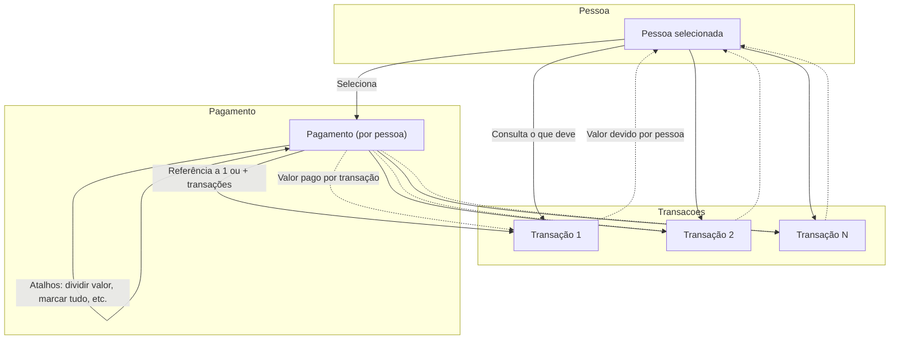

# Guia de Implementação: Módulo de Pagamentos

## 1. Visão Geral
Este documento serve como guia completo para a implementação do frontend do módulo de pagamentos. Ele detalha arquitetura, API, regras de negócio, integrações, fluxos críticos, pontos de atenção e diretrizes de usabilidade, garantindo uma base sólida para evolução e manutenção do sistema.

O módulo de pagamentos permite registrar, consultar e gerenciar pagamentos de transações (gastos), suportando cenários de pagamentos individuais e compostos, processamento automático de excedentes, controle de acesso granular e integração total com o fluxo financeiro do Hub.

---

## 2. Referência da API

### Endpoint Base
`/api/pagamentos`

### Listar Pagamentos
- **GET** `/`
- **Descrição:** Retorna uma lista paginada de pagamentos, com filtros avançados.
- **Query Params:**
  - `pessoa_id`: `number` — Filtrar por pessoa que pagou.
  - `transacao_id`: `number` — Filtrar por transação paga.
  - `data_inicio`, `data_fim`: `YYYY-MM-DD` — Intervalo de datas.
  - `forma_pagamento`: `"PIX" | "DINHEIRO" | "TRANSFERENCIA" | "DEBITO" | "CREDITO" | "OUTROS"`
  - `tem_excedente`: `boolean` — Filtrar pagamentos com/sem excedente.
  - `valor_min`, `valor_max`: `number` — Faixa de valores.
  - `page`, `limit`: Paginação.
  - `sort_by`, `sort_order`: Ordenação.
- **Permissões:** `PROPRIETARIO`, `ADMINISTRADOR`, `COLABORADOR`.

### Detalhar Pagamento
- **GET** `/:id`
- **Descrição:** Retorna detalhes completos de um pagamento, incluindo transações pagas, pessoa, registrador e excedente.
- **Permissões:** `PROPRIETARIO`, `ADMINISTRADOR`, `COLABORADOR`.

### Criar Pagamento (Individual ou Composto)
- **POST** `/`
- **Descrição:** Cria um novo pagamento, podendo quitar uma ou várias transações em uma única operação.
- **Permissões:** `PROPRIETARIO`, `ADMINISTRADOR`, `COLABORADOR`.
- **Body (Individual):**
```json
{
  "transacao_id": "number (obrigatório)",
  "valor_pago": "number (obrigatório, >0)",
  "data_pagamento": "YYYY-MM-DD (obrigatório)",
  "forma_pagamento": "PIX|DINHEIRO|TRANSFERENCIA|DEBITO|CREDITO|OUTROS (opcional, padrão: PIX)",
  "observacoes": "string (opcional, até 1000)"
}
```
- **Body (Composto):**
```json
{
  "pessoa_id": "number (opcional, padrão: usuário logado)",
  "transacoes": [
    { "transacao_id": "number (obrigatório)", "valor_aplicado": "number (>0)" }
  ],
  "valor_total": "number (opcional, soma dos valores aplicados)",
  "data_pagamento": "YYYY-MM-DD (obrigatório)",
  "forma_pagamento": "PIX|DINHEIRO|TRANSFERENCIA|DEBITO|CREDITO|OUTROS (opcional, padrão: PIX)",
  "observacoes": "string (opcional, até 1000)",
  "processar_excedente": "boolean (opcional, padrão: true)"
}
```

### Atualizar Pagamento
- **PUT** `/:id`
- **Descrição:** Atualiza informações de um pagamento existente (restrito a pagamentos não totalmente quitados).
- **Permissões:** `PROPRIETARIO`, `ADMINISTRADOR`, `COLABORADOR`.

### Excluir Pagamento
- **DELETE** `/:id`
- **Descrição:** Remove um pagamento (restrito a permissões e regras de negócio).
- **Permissões:** `PROPRIETARIO`, `ADMINISTRADOR`.

### Configuração de Excedente
- **GET/PUT** `/configuracoes/excedente`
- **Descrição:** Consulta e atualiza regras de processamento automático de excedente.

---

## 3. Lógica de Negócio e Fluxos Essenciais

### Pagamento Individual vs. Composto
- **Individual:** Quita uma única transação.
- **Composto:** Permite pagar múltiplas transações em uma única operação, distribuindo valores e processando excedentes automaticamente.

### Processamento de Excedente
- Se o valor pago for maior que o devido, o sistema pode criar automaticamente uma receita de excedente, vinculada ao pagamento original.
- Configurações de excedente são controladas pelo proprietário do Hub.

### Validações Críticas
- Usuário deve ser participante das transações que deseja pagar.
- Não é possível pagar transações do tipo RECEITA.
- Não é possível editar/excluir pagamentos que já quitaram totalmente transações.
- Valores aplicados não podem exceder o devido por transação.

### Controle de Acesso (RBAC) Resumido
| Ação | Permissões |
| :--- | :--- |
| **Criar** | `PROPRIETARIO`, `ADMINISTRADOR`, `COLABORADOR` |
| **Visualizar** | Todos os papéis |
| **Editar** | `PROPRIETARIO`, `ADMINISTRADOR`, `COLABORADOR` (restrições) |
| **Excluir** | `PROPRIETARIO`, `ADMINISTRADOR` |

---

## 4. Guia de Implementação Frontend (UX/UI)

### 4.1. Componente: `PaymentsDataTable` (Listagem Principal)
- **Estrutura:** Tabela robusta (ex: TanStack Table).
- **Colunas Sugeridas:** Data, Valor, Forma de Pagamento, Pagador, Transações Pagas, Excedente, Observações, Ações.
- **Busca e Filtragem:**
  - Campo de busca global.
  - Filtros por data, pagador, forma de pagamento, valor, excedente.
- **Ações por Linha:**
  - `Ver Detalhes`: Abre modal ou página detalhada.
  - `Editar`: Abre formulário de edição (se permitido).
  - `Excluir`: Remove pagamento (com confirmação).

### 4.2. Componente Detalhado: Formulário de Pagamento (`PaymentForm`)
- **Campos:**
  - Data do Pagamento (obrigatório, date picker)
  - Forma de Pagamento (select)
  - Valor Total (obrigatório, moeda)
  - Observações (opcional)
  - Participantes/Transações a pagar (multi-select, valores aplicados)
  - Processar Excedente (switch)
- **Validações:**
  - Valor total deve ser igual à soma dos valores aplicados.
  - Não permitir valores negativos ou inconsistentes.
- **Resumo e Confirmação:**
  - Exibir resumo antes de submeter.
  - Botões: "Confirmar e Salvar", "Salvar e Adicionar Outro", "Editar".

### 4.3. Integração com Transações
- Pagamentos devem atualizar automaticamente o status das transações pagas.
- Excedentes processados devem ser visíveis e rastreáveis.

---

## 5. Estratégia de Gerenciamento de Estado (Frontend)
- **TanStack Query** para cache, paginação, mutações e atualização automática.
- `useQuery` para listagem e detalhes.
- `useMutation` para criar, editar, excluir.
- Invalidação automática das queries de pagamentos e transações após mutações.

---

## 6. Tratamento de Erros e Acessibilidade

### Tratamento de Erros
| Código HTTP | Significado | Ação na UI |
| :--- | :--- | :--- |
| **400** | Erro de validação | Exibir mensagem ao lado do campo |
| **401** | Não autenticado | Redirecionar para login |
| **403** | Sem permissão | Toast de erro, desabilitar ação |
| **404** | Não encontrado | Exibir alerta ou redirecionar |
| **409** | Conflito | Exibir mensagem no campo relevante |
| **500** | Erro interno | Toast amigável, logar erro |

### Acessibilidade (a11y)
- Navegação por teclado em todos os campos e ações.
- Foco automático e retorno ao fechar modais/dialogs.
- Labels e ARIA em todos os campos e botões.

---

## 7. Pontos de Atenção, Riscos e Estratégia de Modificação

- **Pontos Críticos:**  
  - Integração com transações, saldos e receitas de excedente.
  - Validações de participação e valores.
  - Permissões e regras de negócio.
- **Riscos:**  
  - Alterações podem impactar saldos, relatórios e integridade financeira.
  - Testar todos os fluxos de pagamento, inclusive casos de excedente.
- **Estratégia Segura:**  
  - Modificar preferencialmente via endpoints e schemas já existentes.
  - Garantir cobertura de testes de integração/end-to-end.
  - Validar sempre em ambiente de homologação antes de produção.

---

## 8. Comandos Executados e Arquivos Analisados

### Comandos Utilizados
- codebase_search: localização, estrutura, integrações
- grep_search: imports, endpoints, testes
- Análise de controllers, schemas, rotas, tipos, scripts de teste

### Arquivos Analisados
- `backend/controllers/pagamentoController.ts`
- `backend/routes/pagamento.ts`
- `backend/schemas/pagamento.ts`
- `backend/prisma/schema.prisma`
- `backend/types/index.ts`
- `frontend/src/lib/api.ts`
- `frontend/src/lib/types.ts`
- `frontend/src/lib/validations.ts`
- `frontend/src/app/(auth)/pagamentos/page.tsx`
- `backend/scripts/test42end.js`
- `docs/API.md`
- `docs/multi-tenancy/03_PROPOSED_SCHEMA.prisma`
- `docs/multi-tenancy/04_GENERATED_MIGRATION.sql`

---

## 9. Respostas Direcionadoras

1. **Identidade:** Gerencia pagamentos de transações, incluindo múltiplas transações e excedentes.
2. **Responsabilidades:** Registrar, listar, detalhar, atualizar e excluir pagamentos; processar excedentes; atualizar status de transações.
3. **Interfaces:** Endpoints RESTful, integração com frontend via API centralizada.
4. **Dados:** Manipula pagamentos, transações pagas, participantes, valores, excedentes, configurações.
5. **Dependências:** Depende de transações, participantes, configurações; é consumido por frontend, relatórios e scripts.
6. **Estado Atual:** Código robusto, validado, com testes de integração/end-to-end.
7. **Riscos:** Impacto em saldos, relatórios, integridade financeira; dependências críticas.
8. **Oportunidades:** Melhorias em UX, relatórios de pagamentos, automação de notificações, cobertura de testes unitários.

---

> Este guia cobre todos os aspectos essenciais para implementação, manutenção e evolução do módulo de pagamentos, seguindo o padrão de documentação do projeto. 

---

## Diagrama de Uso do Módulo de Pagamentos



---

## Informações e Comportamentos Específicos Esperados no Frontend

### 1. Associação Pagamento ↔ Transações (por Pessoa)
- Um pagamento sempre é feito por uma pessoa específica.
- Um pagamento pode referenciar uma ou mais transações (ex: pagar várias dívidas de uma vez).
- Cada referência de transação dentro do pagamento deve conter:
  - **ID da transação**
  - **Valor devido pela pessoa naquela transação**
  - **Valor que está sendo pago naquela transação** (pode ser parcial ou total)

### 2. Seleção de Pessoa e Consulta de Débitos
- Ao selecionar uma pessoa, o frontend deve buscar e exibir:
  - Todas as transações em que ela possui saldo devedor.
  - Para cada transação:
    - Valor total da transação
    - Valor devido por essa pessoa (pode ser diferente do valor total, se for participante)
    - Valor já pago por ela (somatório de pagamentos anteriores)
    - Saldo devedor (valor devido - valor já pago)
    - Status (em aberto, quitado, parcial)

### 3. Seleção e Atalhos para Pagamento
- O usuário pode:
  - Selecionar/deselecionar transações para incluir no pagamento.
  - Editar o valor a ser pago em cada transação (não precisa ser o valor total devido).
- Atalhos inteligentes:
  - **Pagar tudo**: marca todas as transações e preenche o valor de cada uma com o saldo devedor.
  - **Dividir igualmente**: distribui um valor total informado pelo usuário entre as transações selecionadas.
  - **Marcar/desmarcar todas**: seleção rápida.
  - **Customizar valor**: campo editável para cada transação.
- Feedback visual claro para cada ação (ex: highlight em transações selecionadas, aviso de saldo insuficiente, etc).

### 4. UX e Detalhes de Implementação
- Exibir resumo do pagamento antes de confirmar (total, transações, valores).
- Validar que o valor pago não excede o saldo devedor de cada transação.
- Permitir desfazer ações rapidamente.
- Garantir acessibilidade (atalhos de teclado, foco, contraste).

---

## Fluxos de Tela — Passo a Passo

### Fluxo 1: Seleção de Pessoa
1. Usuário acessa a tela de pagamentos.
2. Visualiza lista de pessoas com saldo devedor.
3. Seleciona uma pessoa.

### Fluxo 2: Consulta de Débitos
1. Ao selecionar a pessoa, o sistema exibe todas as transações em que ela deve.
2. Para cada transação, mostra:
   - Descrição
   - Valor total
   - Valor devido pela pessoa
   - Valor já pago
   - Saldo devedor
   - Status

### Fluxo 3: Seleção de Transações e Edição de Valores
1. Usuário pode marcar/desmarcar transações para pagamento.
2. Pode editar o valor a ser pago em cada transação (campo editável).
3. Pode usar atalhos:
   - Pagar tudo (preenche todos os valores com o saldo devedor)
   - Dividir igualmente (distribui valor total informado)
   - Marcar/desmarcar todas

### Fluxo 4: Resumo e Confirmação
1. Sistema exibe resumo do pagamento:
   - Total a pagar
   - Lista de transações selecionadas e valores
2. Usuário revisa e confirma o pagamento.
3. Feedback visual de sucesso ou erro.

--- 