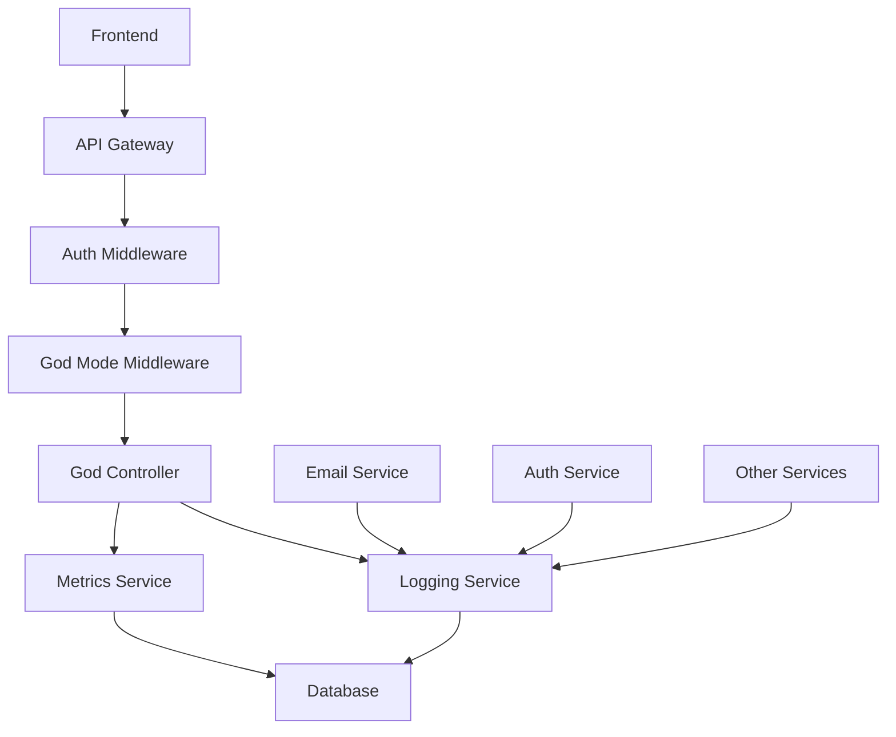
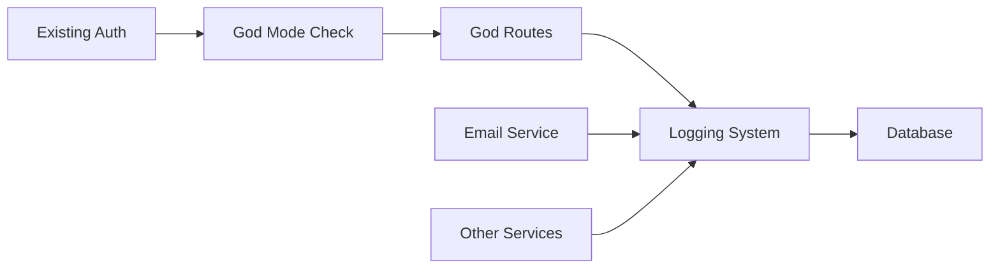

# 📋 **PLANO DE IMPLEMENTAÇÃO - MODO DEUS**
## Sistema de Monitoramento e Logs Avançados

**Data:** 20/01/2025  
**Versão:** 1.0  
**Autor:** Cursor AI Assistant  
**Status:** Análise Completa

---

## 📋 **SUMÁRIO EXECUTIVO**

### **Objetivo**
Implementar um sistema de monitoramento completo ("Modo Deus") que permite visualização em tempo real de logs, métricas e status de toda a aplicação, com acesso restrito apenas a usuários autorizados via configuração manual no banco de dados.

### **Escopo**
- Sistema de logs persistentes no banco de dados
- Dashboard de monitoramento em tempo real
- Métricas de performance e uso
- Acesso restrito via campo `is_god` no banco
- Exportação de dados para análise externa

### **Tecnologias**
- **Backend:** Node.js + Express + TypeScript
- **Banco:** PostgreSQL + Prisma ORM
- **Email:** Nodemailer + Gmail SMTP
- **Autenticação:** JWT + Middleware customizado
- **Monitoramento:** Winston + Logs customizados

---

## 1. ANÁLISE INICIAL DO ESTADO ATUAL

### **1.1 Arquitetura Atual**

#### **Estrutura do Projeto**
```
backend/
├── app.ts                 # Aplicação principal
├── middleware/
│   ├── auth.ts           # Autenticação e autorização
│   └── prisma.ts         # Injeção do Prisma
├── controllers/          # Lógica de negócio
├── routes/              # Definição de rotas
├── services/            # Serviços (Email, etc.)
├── utils/               # Utilitários
├── types/               # Tipos TypeScript
├── schemas/             # Validação Zod
└── prisma/
    └── schema.prisma    # Schema do banco
```

#### **Padrões Identificados**
- **Arquitetura MVC:** Controllers, Routes, Services separados
- **Middleware Pattern:** Autenticação, validação, injeção de dependências
- **Singleton Pattern:** EmailService com instância única
- **Repository Pattern:** Prisma como ORM
- **Multi-tenancy:** Sistema de Hubs com isolamento

### **1.2 Componentes Existentes**

#### **Sistema de Autenticação**
- ✅ JWT com tokens de acesso e refresh
- ✅ Middleware `requireAuth` para proteção de rotas
- ✅ Middleware `requireAdminSystem` para administradores
- ✅ Validação de contexto de Hub
- ✅ Sistema de roles (ADMIN, COLABORADOR)

#### **Sistema de Email**
- ✅ EmailService com padrão Singleton
- ✅ Templates HTML e texto
- ✅ Sistema de retry e monitoramento
- ✅ Integração com Gmail SMTP
- ✅ Logs de envio e contadores

#### **Banco de Dados**
- ✅ Schema Prisma com multi-tenancy
- ✅ Modelo `pessoas` com campos de convite
- ✅ Relacionamentos Hub-Membros
- ✅ Índices otimizados
- ✅ Migrações automáticas

### **1.3 Tecnologias e Dependências**

#### **Core Technologies**
- **Node.js:** v18+ (runtime)
- **Express:** v4.21.1 (framework web)
- **TypeScript:** v5.8.3 (linguagem)
- **PostgreSQL:** v14+ (banco de dados)
- **Prisma:** v6.12.0 (ORM)

#### **Dependências Principais**
- **Autenticação:** `jsonwebtoken`, `bcrypt`
- **Email:** `nodemailer`, `@types/nodemailer`
- **Validação:** `zod`
- **Segurança:** `helmet`, `cors`, `express-rate-limit`
- **Logs:** `winston` (já configurado)

---

## 2. ANÁLISE DE IMPACTO E DEPENDÊNCIAS

### **2.1 Pontos de Impacto**

#### **Banco de Dados**
- **Modificação:** Adicionar campo `is_god` na tabela `pessoas`
- **Novas Tabelas:** `system_logs`, `system_metrics`
- **Índices:** Para performance de consultas de logs
- **Migração:** Script de migração Prisma

#### **Autenticação**
- **Modificação:** Middleware `requireGodMode`
- **Integração:** Com sistema de JWT existente
- **Segurança:** Verificação adicional de privilégios

#### **Logging**
- **Novo Sistema:** Logs persistentes no banco
- **Integração:** Com Winston existente
- **Performance:** Sistema assíncrono para não impactar

#### **API Routes**
- **Novas Rotas:** `/api/god/*` para funcionalidades
- **Proteção:** Middleware de verificação
- **Documentação:** Swagger/OpenAPI

### **2.2 Dependências Diretas**

#### **Internas**
- `middleware/auth.ts` - Sistema de autenticação
- `utils/prisma.ts` - Cliente do banco
- `types/index.ts` - Tipos TypeScript
- `services/emailService.ts` - Sistema de email

#### **Externas**
- `winston` - Sistema de logs
- `@prisma/client` - ORM
- `express` - Framework web

### **2.3 Dependências Indiretas**

#### **Frontend**
- Novas páginas para dashboard
- Componentes de visualização
- Integração com API

#### **Infraestrutura**
- Performance do banco com logs
- Armazenamento de dados
- Backup de logs

### **2.4 Potenciais Conflitos**

#### **Performance**
- **Risco:** Logs podem sobrecarregar o banco
- **Mitigação:** Sistema assíncrono + limpeza automática

#### **Segurança**
- **Risco:** Exposição de dados sensíveis
- **Mitigação:** Filtros e sanitização rigorosos

#### **Compatibilidade**
- **Risco:** Quebra de funcionalidades existentes
- **Mitigação:** Testes extensivos + rollback

---

## 3. PLANO DE IMPLEMENTAÇÃO DETALHADO

### **3.1 Arquitetura da Solução**

#### **Diagrama da Nova Arquitetura**



#### **Integração com Sistemas Existentes**



#### **Padrões de Design**

1. **Observer Pattern:** Para captura de eventos
2. **Factory Pattern:** Para criação de logs
3. **Strategy Pattern:** Para diferentes tipos de métricas
4. **Repository Pattern:** Para acesso aos dados
5. **Middleware Pattern:** Para verificação de privilégios

#### **Estrutura de Pastas**

```
backend/
├── controllers/
│   └── godController.ts      # Controller do Modo Deus
├── middleware/
│   └── godMode.ts           # Middleware de verificação
├── services/
│   ├── loggingService.ts    # Serviço de logs
│   └── metricsService.ts    # Serviço de métricas
├── routes/
│   └── god.ts              # Rotas do Modo Deus
├── types/
│   └── god.ts              # Tipos específicos
└── utils/
    └── godUtils.ts         # Utilitários
```

### **3.2 Modificações Necessárias**

#### **3.2.1 Banco de Dados**

**Arquivo:** `prisma/schema.prisma`

```prisma
// Adicionar campo is_god na tabela pessoas
model pessoas {
  // ... campos existentes ...
  is_god Boolean @default(false)
  
  @@index([is_god], map: "idx_pessoas_is_god")
}

// Nova tabela para logs do sistema
model system_logs {
  id          Int      @id @default(autoincrement())
  timestamp   DateTime @default(now()) @db.Timestamptz(6)
  level       String   @db.VarChar(10) // 'INFO', 'WARN', 'ERROR', 'DEBUG'
  category    String   @db.VarChar(50) // 'EMAIL', 'AUTH', 'DATABASE', 'API'
  message     String   @db.Text
  details     Json?    // Dados adicionais estruturados
  user_id     Int?     @db.Integer
  ip_address  String?  @db.VarChar(45)
  user_agent  String?  @db.Text
  hub_id      Int?     @db.Integer
  
  @@index([timestamp], map: "idx_system_logs_timestamp")
  @@index([level], map: "idx_system_logs_level")
  @@index([category], map: "idx_system_logs_category")
  @@index([user_id], map: "idx_system_logs_user")
  @@index([hub_id], map: "idx_system_logs_hub")
}

// Nova tabela para métricas do sistema
model system_metrics {
  id           Int      @id @default(autoincrement())
  timestamp    DateTime @default(now()) @db.Timestamptz(6)
  metric_name  String   @db.VarChar(100)
  metric_value Decimal  @db.Decimal(10, 2)
  metadata     Json?
  
  @@index([timestamp], map: "idx_system_metrics_timestamp")
  @@index([metric_name], map: "idx_system_metrics_name")
}
```

#### **3.2.2 Middleware de Verificação**

**Arquivo:** `middleware/godMode.ts`

```typescript
import { Request, Response, NextFunction } from 'express';

export const requireGodMode = async (req: Request, res: Response, next: NextFunction): Promise<void> => {
  try {
    if (!req.auth) {
      res.status(401).json({ 
        error: 'NaoAutenticado', 
        message: 'Autenticação necessária para Modo Deus.' 
      });
      return;
    }

    // Verificar se o usuário tem privilégio de Deus
    const user = await req.prisma.pessoas.findUnique({
      where: { id: req.auth.pessoaId },
      select: { is_god: true }
    });

    if (!user?.is_god) {
      res.status(403).json({ 
        error: 'AcessoNegado', 
        message: 'Acesso negado - Modo Deus necessário.' 
      });
      return;
    }

    next();
  } catch (error) {
    console.error('[requireGodMode] Erro:', error);
    res.status(500).json({ 
      error: 'ErroInterno', 
      message: 'Erro ao verificar privilégios de Deus.' 
    });
  }
};
```

#### **3.2.3 Tipos TypeScript Específicos**

**Arquivo:** `types/god.ts`

```typescript
import { AuthContext } from './index';

// Contexto específico para Modo Deus
export interface GodModeContext extends AuthContext {
  isGod: boolean;
}

// Enums para logs e métricas
export enum LogLevel {
  INFO = 'INFO',
  WARN = 'WARN',
  ERROR = 'ERROR',
  DEBUG = 'DEBUG'
}

export enum LogCategory {
  EMAIL = 'EMAIL',
  AUTH = 'AUTH',
  DATABASE = 'DATABASE',
  API = 'API',
  SYSTEM = 'SYSTEM',
  SECURITY = 'SECURITY',
  TRANSACTION = 'TRANSACTION',
  PAYMENT = 'PAYMENT',
  HUB = 'HUB'
}

export enum MetricType {
  // Email Metrics
  EMAILS_SENT_TODAY = 'emails_sent_today',
  EMAILS_FAILED_TODAY = 'emails_failed_today',
  EMAIL_SUCCESS_RATE = 'email_success_rate',
  EMAIL_QUEUE_SIZE = 'email_queue_size',
  
  // Auth Metrics
  LOGIN_ATTEMPTS = 'login_attempts',
  FAILED_LOGINS = 'failed_logins',
  ACTIVE_USERS = 'active_users',
  TOKEN_REFRESHES = 'token_refreshes',
  
  // API Metrics
  API_REQUESTS_PER_MINUTE = 'api_requests_per_minute',
  API_ERROR_RATE = 'api_error_rate',
  AVERAGE_RESPONSE_TIME = 'average_response_time',
  ENDPOINT_USAGE = 'endpoint_usage',
  
  // Database Metrics
  DATABASE_CONNECTIONS = 'database_connections',
  SLOW_QUERIES = 'slow_queries',
  QUERY_EXECUTION_TIME = 'query_execution_time',
  
  // System Metrics
  MEMORY_USAGE = 'memory_usage',
  CPU_USAGE = 'cpu_usage',
  DISK_USAGE = 'disk_usage',
  UPTIME = 'uptime',
  
  // Business Metrics
  TRANSACTIONS_CREATED_TODAY = 'transactions_created_today',
  PAYMENTS_PROCESSED_TODAY = 'payments_processed_today',
  ACTIVE_HUBS = 'active_hubs',
  TOTAL_USERS = 'total_users'
}

// Interfaces para logs
export interface LogData {
  level: LogLevel;
  category: LogCategory;
  message: string;
  details?: any;
  userId?: number;
  hubId?: number;
  ipAddress?: string;
  userAgent?: string;
}

export interface SystemLog {
  id: number;
  timestamp: Date;
  level: LogLevel;
  category: LogCategory;
  message: string;
  details?: any;
  userId?: number;
  hubId?: number;
  ipAddress?: string;
  userAgent?: string;
}

// Interfaces para métricas
export interface MetricData {
  metricName: MetricType;
  metricValue: number;
  metadata?: any;
  timestamp?: Date;
}

export interface SystemMetric {
  id: number;
  timestamp: Date;
  metricName: MetricType;
  metricValue: number;
  metadata?: any;
}

// Interfaces para dashboard
export interface DashboardData {
  emailMetrics: EmailMetrics;
  authMetrics: AuthMetrics;
  systemMetrics: SystemMetrics;
  recentLogs: SystemLog[];
  errorCount: number;
  timestamp: string;
}

export interface EmailMetrics {
  sentToday: number;
  failedToday: number;
  successRate: number;
  queueSize: number;
}

export interface AuthMetrics {
  loginAttempts: number;
  failedLogins: number;
  activeUsers: number;
  tokenRefreshes: number;
}

export interface SystemMetrics {
  memoryUsage: number;
  cpuUsage: number;
  diskUsage: number;
  uptime: number;
  databaseConnections: number;
}

// Interfaces para filtros
export interface LogFilters {
  level?: LogLevel;
  category?: LogCategory;
  userId?: number;
  hubId?: number;
  startDate?: Date;
  endDate?: Date;
  limit?: number;
  offset?: number;
}

export interface MetricFilters {
  metricName?: MetricType;
  startDate?: Date;
  endDate?: Date;
  limit?: number;
  offset?: number;
}
```

#### **3.2.4 Serviço de Logging (Integrado com Winston)**

**Arquivo:** `services/loggingService.ts`

```typescript
import { PrismaClient } from '@prisma/client';
import { getLogger } from '../utils/logger';
import { LogLevel, LogCategory, LogData, SystemLog, LogFilters } from '../types/god';

export class LoggingService {
  private static instance: LoggingService;
  private prisma: PrismaClient;
  private logger = getLogger('LoggingService');

  private constructor(prisma: PrismaClient) {
    this.prisma = prisma;
  }

  static getInstance(prisma: PrismaClient): LoggingService {
    if (!LoggingService.instance) {
      LoggingService.instance = new LoggingService(prisma);
    }
    return LoggingService.instance;
  }

  async log(data: LogData): Promise<void> {
    try {
      // Primeiro, log no Winston para consistência
      this.logger.info(data.message, { 
        level: data.level, 
        category: data.category,
        userId: data.userId,
        hubId: data.hubId,
        ipAddress: data.ipAddress,
        userAgent: data.userAgent,
        details: data.details
      });
      
      // Depois, salvar no banco de dados
      await this.saveToDatabase(data);
    } catch (error) {
      this.logger.error('Erro ao processar log:', error);
    }
  }

  private async saveToDatabase(data: LogData): Promise<void> {
    try {
      await this.prisma.system_logs.create({
        data: {
          level: data.level,
          category: data.category,
          message: data.message,
          details: data.details ? JSON.stringify(data.details) : null,
          user_id: data.userId,
          hub_id: data.hubId,
          ip_address: data.ipAddress,
          user_agent: data.userAgent
        }
      });
    } catch (error) {
      this.logger.error('Erro ao salvar log no banco:', error);
      throw error;
    }
  }

  async getLogs(filters: LogFilters): Promise<{ logs: SystemLog[]; total: number }> {
    try {
      const where: any = {};
      
      if (filters.level) where.level = filters.level;
      if (filters.category) where.category = filters.category;
      if (filters.userId) where.user_id = filters.userId;
      if (filters.hubId) where.hub_id = filters.hubId;
      
      if (filters.startDate || filters.endDate) {
        where.timestamp = {};
        if (filters.startDate) where.timestamp.gte = filters.startDate;
        if (filters.endDate) where.timestamp.lte = filters.endDate;
      }

      const [logs, total] = await Promise.all([
        this.prisma.system_logs.findMany({
          where,
          orderBy: { timestamp: 'desc' },
          take: filters.limit || 100,
          skip: filters.offset || 0
        }),
        this.prisma.system_logs.count({ where })
      ]);

      return { 
        logs: logs.map(log => ({
          ...log,
          timestamp: log.timestamp,
          details: log.details ? JSON.parse(log.details as string) : null
        })), 
        total 
      };
    } catch (error) {
      this.logger.error('Erro ao buscar logs:', error);
      throw error;
    }
  }

  async getLogsByCategory(category: LogCategory, limit: number = 50): Promise<SystemLog[]> {
    return this.getLogs({ category, limit }).then(result => result.logs);
  }

  async getErrorLogs(limit: number = 50): Promise<SystemLog[]> {
    return this.getLogs({ level: LogLevel.ERROR, limit }).then(result => result.logs);
  }

  async getRecentLogs(limit: number = 50): Promise<SystemLog[]> {
    return this.getLogs({ limit }).then(result => result.logs);
  }
}
```

#### **3.2.5 Serviço de Métricas**

**Arquivo:** `services/metricsService.ts`

```typescript
import { PrismaClient } from '@prisma/client';
import { getLogger } from '../utils/logger';
import { MetricType, MetricData, SystemMetric, MetricFilters, EmailMetrics, AuthMetrics, SystemMetrics } from '../types/god';

export class MetricsService {
  private static instance: MetricsService;
  private prisma: PrismaClient;
  private logger = getLogger('MetricsService');

  private constructor(prisma: PrismaClient) {
    this.prisma = prisma;
  }

  static getInstance(prisma: PrismaClient): MetricsService {
    if (!MetricsService.instance) {
      MetricsService.instance = new MetricsService(prisma);
    }
    return MetricsService.instance;
  }

  async recordMetric(data: MetricData): Promise<void> {
    try {
      await this.prisma.system_metrics.create({
        data: {
          metric_name: data.metricName,
          metric_value: data.metricValue,
          metadata: data.metadata ? JSON.stringify(data.metadata) : null,
          timestamp: data.timestamp || new Date()
        }
      });
    } catch (error) {
      this.logger.error('Erro ao registrar métrica:', error);
    }
  }

  async getMetrics(filters: MetricFilters): Promise<{ metrics: SystemMetric[]; total: number }> {
    try {
      const where: any = {};
      
      if (filters.metricName) where.metric_name = filters.metricName;
      
      if (filters.startDate || filters.endDate) {
        where.timestamp = {};
        if (filters.startDate) where.timestamp.gte = filters.startDate;
        if (filters.endDate) where.timestamp.lte = filters.endDate;
      }

      const [metrics, total] = await Promise.all([
        this.prisma.system_metrics.findMany({
          where,
          orderBy: { timestamp: 'desc' },
          take: filters.limit || 100,
          skip: filters.offset || 0
        }),
        this.prisma.system_metrics.count({ where })
      ]);

      return { 
        metrics: metrics.map(metric => ({
          ...metric,
          timestamp: metric.timestamp,
          metadata: metric.metadata ? JSON.parse(metric.metadata as string) : null
        })), 
        total 
      };
    } catch (error) {
      this.logger.error('Erro ao buscar métricas:', error);
      throw error;
    }
  }

  async getEmailMetrics(): Promise<EmailMetrics> {
    const today = new Date();
    today.setHours(0, 0, 0, 0);

    const [sentToday, failedToday] = await Promise.all([
      this.getMetricValue(MetricType.EMAILS_SENT_TODAY, today),
      this.getMetricValue(MetricType.EMAILS_FAILED_TODAY, today)
    ]);

    const successRate = sentToday > 0 ? ((sentToday - failedToday) / sentToday) * 100 : 0;

    return {
      sentToday,
      failedToday,
      successRate: Math.round(successRate * 100) / 100,
      queueSize: await this.getMetricValue(MetricType.EMAIL_QUEUE_SIZE)
    };
  }

  async getAuthMetrics(): Promise<AuthMetrics> {
    const today = new Date();
    today.setHours(0, 0, 0, 0);

    const [loginAttempts, failedLogins, activeUsers, tokenRefreshes] = await Promise.all([
      this.getMetricValue(MetricType.LOGIN_ATTEMPTS, today),
      this.getMetricValue(MetricType.FAILED_LOGINS, today),
      this.getMetricValue(MetricType.ACTIVE_USERS),
      this.getMetricValue(MetricType.TOKEN_REFRESHES, today)
    ]);

    return {
      loginAttempts,
      failedLogins,
      activeUsers,
      tokenRefreshes
    };
  }

  async getSystemMetrics(): Promise<SystemMetrics> {
    const [memoryUsage, cpuUsage, diskUsage, uptime, databaseConnections] = await Promise.all([
      this.getMetricValue(MetricType.MEMORY_USAGE),
      this.getMetricValue(MetricType.CPU_USAGE),
      this.getMetricValue(MetricType.DISK_USAGE),
      this.getMetricValue(MetricType.UPTIME),
      this.getMetricValue(MetricType.DATABASE_CONNECTIONS)
    ]);

    return {
      memoryUsage,
      cpuUsage,
      diskUsage,
      uptime,
      databaseConnections
    };
  }

  private async getMetricValue(metricName: MetricType, since?: Date): Promise<number> {
    try {
      const where: any = { metric_name: metricName };
      if (since) {
        where.timestamp = { gte: since };
      }

      const result = await this.prisma.system_metrics.aggregate({
        where,
        _sum: { metric_value: true }
      });

      return result._sum.metric_value || 0;
    } catch (error) {
      this.logger.error(`Erro ao buscar métrica ${metricName}:`, error);
      return 0;
    }
  }

  // Métodos para registrar métricas específicas
  async recordEmailSent(): Promise<void> {
    await this.recordMetric({
      metricName: MetricType.EMAILS_SENT_TODAY,
      metricValue: 1
    });
  }

  async recordEmailFailed(): Promise<void> {
    await this.recordMetric({
      metricName: MetricType.EMAILS_FAILED_TODAY,
      metricValue: 1
    });
  }

  async recordLoginAttempt(success: boolean): Promise<void> {
    await this.recordMetric({
      metricName: MetricType.LOGIN_ATTEMPTS,
      metricValue: 1
    });

    if (!success) {
      await this.recordMetric({
        metricName: MetricType.FAILED_LOGINS,
        metricValue: 1
      });
    }
  }

  async recordApiRequest(responseTime: number): Promise<void> {
    await this.recordMetric({
      metricName: MetricType.API_REQUESTS_PER_MINUTE,
      metricValue: 1
    });

    await this.recordMetric({
      metricName: MetricType.AVERAGE_RESPONSE_TIME,
      metricValue: responseTime
    });
  }
}
```

#### **3.2.6 Controller do Modo Deus**

**Arquivo:** `controllers/godController.ts`

```typescript
import { Request, Response } from 'express';
import { getLogger } from '../utils/logger';
import { LoggingService } from '../services/loggingService';
import { MetricsService } from '../services/metricsService';
import { LogLevel, LogCategory, DashboardData } from '../types/god';

const logger = getLogger('GodController');

export const getDashboard = async (req: Request, res: Response): Promise<void> => {
  try {
    const loggingService = LoggingService.getInstance(req.prisma);
    const metricsService = MetricsService.getInstance(req.prisma);

    // Buscar métricas em tempo real
    const [
      emailMetrics,
      authMetrics,
      systemMetrics,
      recentLogs,
      errorCount
    ] = await Promise.all([
      metricsService.getEmailMetrics(),
      metricsService.getAuthMetrics(),
      metricsService.getSystemMetrics(),
      loggingService.getRecentLogs(50),
      loggingService.getLogs({ 
        level: LogLevel.ERROR, 
        startDate: new Date(Date.now() - 30 * 60 * 1000) // Últimos 30 min
      })
    ]);

    const dashboardData: DashboardData = {
      emailMetrics,
      authMetrics,
      systemMetrics,
      recentLogs: recentLogs,
      errorCount: errorCount.total,
      timestamp: new Date().toISOString()
    };

    res.json({
      success: true,
      data: dashboardData
    });
  } catch (error) {
    logger.error('Erro no dashboard:', error);
    res.status(500).json({ 
      error: 'ErroInterno', 
      message: 'Erro ao carregar dashboard.' 
    });
  }
};

export const getLogs = async (req: Request, res: Response): Promise<void> => {
  try {
    const { 
      level, 
      category, 
      userId, 
      hubId, 
      startDate, 
      endDate, 
      page = 1, 
      limit = 100 
    } = req.query;

    const loggingService = LoggingService.getInstance(req.prisma);
    
    const filters = {
      level: level as LogLevel,
      category: category as LogCategory,
      userId: userId ? parseInt(userId as string) : undefined,
      hubId: hubId ? parseInt(hubId as string) : undefined,
      startDate: startDate ? new Date(startDate as string) : undefined,
      endDate: endDate ? new Date(endDate as string) : undefined,
      limit: parseInt(limit as string),
      offset: (parseInt(page as string) - 1) * parseInt(limit as string)
    };

    const result = await loggingService.getLogs(filters);

    res.json({
      success: true,
      data: result.logs,
      pagination: {
        page: parseInt(page as string),
        limit: parseInt(limit as string),
        total: result.total,
        totalPages: Math.ceil(result.total / parseInt(limit as string))
      }
    });
  } catch (error) {
    logger.error('Erro ao buscar logs:', error);
    res.status(500).json({ 
      error: 'ErroInterno', 
      message: 'Erro ao buscar logs.' 
    });
  }
};

export const getMetrics = async (req: Request, res: Response): Promise<void> => {
  try {
    const { metricName, startDate, endDate, page = 1, limit = 100 } = req.query;
    
    const metricsService = MetricsService.getInstance(req.prisma);
    
    const filters = {
      metricName: metricName as any,
      startDate: startDate ? new Date(startDate as string) : undefined,
      endDate: endDate ? new Date(endDate as string) : undefined,
      limit: parseInt(limit as string),
      offset: (parseInt(page as string) - 1) * parseInt(limit as string)
    };

    const result = await metricsService.getMetrics(filters);

    res.json({
      success: true,
      data: result.metrics,
      pagination: {
        page: parseInt(page as string),
        limit: parseInt(limit as string),
        total: result.total,
        totalPages: Math.ceil(result.total / parseInt(limit as string))
      }
    });
  } catch (error) {
    logger.error('Erro ao buscar métricas:', error);
    res.status(500).json({ 
      error: 'ErroInterno', 
      message: 'Erro ao buscar métricas.' 
    });
  }
};

export const getSystemStatus = async (req: Request, res: Response): Promise<void> => {
  try {
    const [dbStatus, emailStatus, uptime] = await Promise.all([
      req.prisma.$queryRaw`SELECT 1 as status`,
      req.prisma.pessoas.count(),
      process.uptime()
    ]);

    res.json({
      success: true,
      data: {
        database: dbStatus ? 'connected' : 'disconnected',
        email: emailStatus > 0 ? 'configured' : 'not_configured',
        uptime: Math.floor(uptime),
        memory: process.memoryUsage(),
        timestamp: new Date().toISOString()
      }
    });
  } catch (error) {
    logger.error('Erro ao verificar status do sistema:', error);
    res.status(500).json({ 
      error: 'ErroInterno', 
      message: 'Erro ao verificar status do sistema.' 
    });
  }
};

export const exportLogs = async (req: Request, res: Response): Promise<void> => {
  try {
    const { format = 'json', startDate, endDate } = req.query;
    
    const loggingService = LoggingService.getInstance(req.prisma);
    
    const filters = {
      startDate: startDate ? new Date(startDate as string) : undefined,
      endDate: endDate ? new Date(endDate as string) : undefined,
      limit: 10000 // Limite para exportação
    };

    const result = await loggingService.getLogs(filters);

    if (format === 'csv') {
      // Implementar exportação CSV
      res.setHeader('Content-Type', 'text/csv');
      res.setHeader('Content-Disposition', 'attachment; filename=logs.csv');
      
      const csvHeader = 'Timestamp,Level,Category,Message,User ID,Hub ID,IP Address\n';
      const csvData = result.logs.map(log => 
        `${log.timestamp},${log.level},${log.category},"${log.message}",${log.userId || ''},${log.hubId || ''},${log.ipAddress || ''}`
      ).join('\n');
      
      res.send(csvHeader + csvData);
    } else {
      res.json({
        success: true,
        data: result.logs,
        exportInfo: {
          format: 'json',
          totalRecords: result.total,
          exportDate: new Date().toISOString()
        }
      });
    }
  } catch (error) {
    logger.error('Erro na exportação:', error);
    res.status(500).json({ 
      error: 'ErroInterno', 
      message: 'Erro na exportação de logs.' 
    });
  }
};
```

#### **3.2.7 Rotas do Modo Deus (Corrigidas)**

**Arquivo:** `routes/god.ts`

```typescript
import { Router } from 'express';
import { requireGodMode } from '../middleware/godMode';
import { 
  getDashboard, 
  getLogs, 
  getMetrics, 
  getSystemStatus,
  exportLogs 
} from '../controllers/godController';

const router = Router();

// Todas as rotas requerem Modo Deus
router.use(requireGodMode);

// Dashboard principal
router.get('/dashboard', getDashboard);

// Logs do sistema
router.get('/logs', getLogs);
router.get('/logs/export', exportLogs);

// Métricas do sistema
router.get('/metrics', getMetrics); // Métricas gerais
router.get('/metrics/email', getMetrics); // Métricas específicas
router.get('/metrics/auth', getMetrics);
router.get('/metrics/system', getMetrics);

// Status do sistema
router.get('/system-status', getSystemStatus);

// Configurações do Modo Deus
router.get('/config', (req, res) => {
  res.json({
    success: true,
    data: {
      features: ['dashboard', 'logs', 'metrics', 'export'],
      retention: {
        logs: '90 days',
        metrics: '30 days'
      },
      limits: {
        exportMaxRecords: 10000,
        dashboardRefreshInterval: 30000
      }
    }
  });
});

export default router;
```

#### **3.2.8 Middleware de Verificação (Corrigido)**

**Arquivo:** `middleware/godMode.ts`

```typescript
import { Request, Response, NextFunction } from 'express';
import { getLogger } from '../utils/logger';

const logger = getLogger('GodModeMiddleware');

export const requireGodMode = async (req: Request, res: Response, next: NextFunction): Promise<void> => {
  try {
    if (!req.auth) {
      res.status(401).json({ 
        error: 'NaoAutenticado', 
        message: 'Autenticação necessária para Modo Deus.' 
      });
      return;
    }

    // Verificar se o usuário tem privilégio de Deus (independente do Hub)
    const user = await req.prisma.pessoas.findUnique({
      where: { id: req.auth.pessoaId },
      select: { is_god: true }
    });

    if (!user?.is_god) {
      logger.warn(`Tentativa de acesso ao Modo Deus por usuário ${req.auth.pessoaId} sem privilégios`);
      res.status(403).json({ 
        error: 'AcessoNegado', 
        message: 'Acesso negado - Modo Deus necessário.' 
      });
      return;
    }

    // Para Modo Deus, não precisamos validar contexto de Hub
    logger.info(`Acesso ao Modo Deus concedido para usuário ${req.auth.pessoaId}`);
    next();
  } catch (error) {
    logger.error('[requireGodMode] Erro:', error);
    res.status(500).json({ 
      error: 'ErroInterno', 
      message: 'Erro ao verificar privilégios de Deus.' 
    });
  }
};
```

#### **3.2.9 Integração no App Principal**

**Modificação:** `app.ts`

```typescript
// Adicionar import
import godRoutes from './routes/god';

// Adicionar rotas do Modo Deus (após outras rotas)
app.use('/api/god', godRoutes);
```

#### **3.2.10 Implementação do Frontend**

**Arquivo:** `frontend/src/app/(auth)/god/page.tsx`

```typescript
'use client';

import { useState, useEffect } from 'react';
import { Card, CardContent, CardHeader, CardTitle } from '@/components/ui/card';
import { Tabs, TabsContent, TabsList, TabsTrigger } from '@/components/ui/tabs';
import { Badge } from '@/components/ui/badge';
import { Button } from '@/components/ui/button';
import { Input } from '@/components/ui/input';
import { Select, SelectContent, SelectItem, SelectTrigger, SelectValue } from '@/components/ui/select';
import { DashboardData, SystemLog, SystemMetric } from '@/types/god';

export default function GodModePage() {
  const [dashboardData, setDashboardData] = useState<DashboardData | null>(null);
  const [logs, setLogs] = useState<SystemLog[]>([]);
  const [metrics, setMetrics] = useState<SystemMetric[]>([]);
  const [loading, setLoading] = useState(true);
  const [activeTab, setActiveTab] = useState('dashboard');

  useEffect(() => {
    loadDashboardData();
  }, []);

  const loadDashboardData = async () => {
    try {
      const response = await fetch('/api/god/dashboard', {
        headers: {
          'Authorization': `Bearer ${localStorage.getItem('token')}`
        }
      });
      
      if (response.ok) {
        const data = await response.json();
        setDashboardData(data.data);
      }
    } catch (error) {
      console.error('Erro ao carregar dashboard:', error);
    } finally {
      setLoading(false);
    }
  };

  const loadLogs = async (filters?: any) => {
    try {
      const params = new URLSearchParams(filters);
      const response = await fetch(`/api/god/logs?${params}`, {
        headers: {
          'Authorization': `Bearer ${localStorage.getItem('token')}`
        }
      });
      
      if (response.ok) {
        const data = await response.json();
        setLogs(data.data);
      }
    } catch (error) {
      console.error('Erro ao carregar logs:', error);
    }
  };

  const loadMetrics = async (filters?: any) => {
    try {
      const params = new URLSearchParams(filters);
      const response = await fetch(`/api/god/metrics?${params}`, {
        headers: {
          'Authorization': `Bearer ${localStorage.getItem('token')}`
        }
      });
      
      if (response.ok) {
        const data = await response.json();
        setMetrics(data.data);
      }
    } catch (error) {
      console.error('Erro ao carregar métricas:', error);
    }
  };

  const exportLogs = async (format: 'json' | 'csv') => {
    try {
      const response = await fetch(`/api/god/logs/export?format=${format}`, {
        headers: {
          'Authorization': `Bearer ${localStorage.getItem('token')}`
        }
      });
      
      if (response.ok) {
        const blob = await response.blob();
        const url = window.URL.createObjectURL(blob);
        const a = document.createElement('a');
        a.href = url;
        a.download = `logs.${format}`;
        a.click();
      }
    } catch (error) {
      console.error('Erro na exportação:', error);
    }
  };

  if (loading) {
    return <div className="flex items-center justify-center h-screen">Carregando...</div>;
  }

  return (
    <div className="container mx-auto p-6">
      <div className="mb-6">
        <h1 className="text-3xl font-bold text-red-600">🔴 Modo Deus</h1>
        <p className="text-gray-600">Monitoramento completo do sistema</p>
      </div>

      <Tabs value={activeTab} onValueChange={setActiveTab}>
        <TabsList className="grid w-full grid-cols-4">
          <TabsTrigger value="dashboard">Dashboard</TabsTrigger>
          <TabsTrigger value="logs">Logs</TabsTrigger>
          <TabsTrigger value="metrics">Métricas</TabsTrigger>
          <TabsTrigger value="status">Status</TabsTrigger>
        </TabsList>

        <TabsContent value="dashboard" className="space-y-4">
          {dashboardData && (
            <>
              <div className="grid grid-cols-1 md:grid-cols-2 lg:grid-cols-4 gap-4">
                <Card>
                  <CardHeader className="flex flex-row items-center justify-between space-y-0 pb-2">
                    <CardTitle className="text-sm font-medium">Emails Hoje</CardTitle>
                    <Badge variant="outline">{dashboardData.emailMetrics.sentToday}</Badge>
                  </CardHeader>
                  <CardContent>
                    <div className="text-2xl font-bold">{dashboardData.emailMetrics.successRate}%</div>
                    <p className="text-xs text-muted-foreground">Taxa de sucesso</p>
                  </CardContent>
                </Card>

                <Card>
                  <CardHeader className="flex flex-row items-center justify-between space-y-0 pb-2">
                    <CardTitle className="text-sm font-medium">Logins</CardTitle>
                    <Badge variant="outline">{dashboardData.authMetrics.loginAttempts}</Badge>
                  </CardHeader>
                  <CardContent>
                    <div className="text-2xl font-bold">{dashboardData.authMetrics.activeUsers}</div>
                    <p className="text-xs text-muted-foreground">Usuários ativos</p>
                  </CardContent>
                </Card>

                <Card>
                  <CardHeader className="flex flex-row items-center justify-between space-y-0 pb-2">
                    <CardTitle className="text-sm font-medium">Erros (30min)</CardTitle>
                    <Badge variant="destructive">{dashboardData.errorCount}</Badge>
                  </CardHeader>
                  <CardContent>
                    <div className="text-2xl font-bold">{dashboardData.systemMetrics.memoryUsage}%</div>
                    <p className="text-xs text-muted-foreground">Uso de memória</p>
                  </CardContent>
                </Card>

                <Card>
                  <CardHeader className="flex flex-row items-center justify-between space-y-0 pb-2">
                    <CardTitle className="text-sm font-medium">Uptime</CardTitle>
                    <Badge variant="outline">{Math.floor(dashboardData.systemMetrics.uptime / 3600)}h</Badge>
                  </CardHeader>
                  <CardContent>
                    <div className="text-2xl font-bold">{dashboardData.systemMetrics.cpuUsage}%</div>
                    <p className="text-xs text-muted-foreground">Uso de CPU</p>
                  </CardContent>
                </Card>
              </div>

              <Card>
                <CardHeader>
                  <CardTitle>Logs Recentes</CardTitle>
                </CardHeader>
                <CardContent>
                  <div className="space-y-2 max-h-96 overflow-y-auto">
                    {dashboardData.recentLogs.map((log) => (
                      <div key={log.id} className="flex items-center space-x-2 p-2 border rounded">
                        <Badge variant={log.level === 'ERROR' ? 'destructive' : 'outline'}>
                          {log.level}
                        </Badge>
                        <span className="text-sm">{log.category}</span>
                        <span className="text-sm text-gray-600">{log.message}</span>
                        <span className="text-xs text-gray-400">
                          {new Date(log.timestamp).toLocaleString()}
                        </span>
                      </div>
                    ))}
                  </div>
                </CardContent>
              </Card>
            </>
          )}
        </TabsContent>

        <TabsContent value="logs" className="space-y-4">
          <div className="flex space-x-2">
            <Select onValueChange={(value) => loadLogs({ level: value })}>
              <SelectTrigger className="w-32">
                <SelectValue placeholder="Nível" />
              </SelectTrigger>
              <SelectContent>
                <SelectItem value="INFO">INFO</SelectItem>
                <SelectItem value="WARN">WARN</SelectItem>
                <SelectItem value="ERROR">ERROR</SelectItem>
                <SelectItem value="DEBUG">DEBUG</SelectItem>
              </SelectContent>
            </Select>
            <Button onClick={() => loadLogs()}>Carregar</Button>
            <Button onClick={() => exportLogs('json')}>Exportar JSON</Button>
            <Button onClick={() => exportLogs('csv')}>Exportar CSV</Button>
          </div>

          <Card>
            <CardContent className="p-0">
              <div className="space-y-2 max-h-96 overflow-y-auto">
                {logs.map((log) => (
                  <div key={log.id} className="flex items-center space-x-2 p-2 border-b">
                    <Badge variant={log.level === 'ERROR' ? 'destructive' : 'outline'}>
                      {log.level}
                    </Badge>
                    <span className="text-sm">{log.category}</span>
                    <span className="text-sm text-gray-600">{log.message}</span>
                    <span className="text-xs text-gray-400">
                      {new Date(log.timestamp).toLocaleString()}
                    </span>
                  </div>
                ))}
              </div>
            </CardContent>
          </Card>
        </TabsContent>

        <TabsContent value="metrics" className="space-y-4">
          <div className="flex space-x-2">
            <Button onClick={() => loadMetrics()}>Carregar Métricas</Button>
          </div>

          <Card>
            <CardContent className="p-0">
              <div className="space-y-2 max-h-96 overflow-y-auto">
                {metrics.map((metric) => (
                  <div key={metric.id} className="flex items-center space-x-2 p-2 border-b">
                    <span className="text-sm font-medium">{metric.metricName}</span>
                    <span className="text-sm">{metric.metricValue}</span>
                    <span className="text-xs text-gray-400">
                      {new Date(metric.timestamp).toLocaleString()}
                    </span>
                  </div>
                ))}
              </div>
            </CardContent>
          </Card>
        </TabsContent>

        <TabsContent value="status" className="space-y-4">
          <Card>
            <CardHeader>
              <CardTitle>Status do Sistema</CardTitle>
            </CardHeader>
            <CardContent>
              <div className="space-y-2">
                <div className="flex justify-between">
                  <span>Database:</span>
                  <Badge variant="outline">Connected</Badge>
                </div>
                <div className="flex justify-between">
                  <span>Email Service:</span>
                  <Badge variant="outline">Configured</Badge>
                </div>
                <div className="flex justify-between">
                  <span>Uptime:</span>
                  <span>{dashboardData?.systemMetrics.uptime || 0}s</span>
                </div>
              </div>
            </CardContent>
          </Card>
        </TabsContent>
      </Tabs>
    </div>
  );
}
```

**Arquivo:** `frontend/src/types/god.ts`

```typescript
// Re-export dos tipos do backend
export * from '../../../backend/types/god';
```

#### **3.2.11 Integração com Serviços Existentes**

**Arquivo:** `utils/godUtils.ts`

```typescript
import { getLogger } from './logger';
import { LoggingService } from '../services/loggingService';
import { MetricsService } from '../services/metricsService';
import { LogLevel, LogCategory, MetricType } from '../types/god';

const logger = getLogger('GodUtils');

// Wrapper para integrar logs em serviços existentes
export class GodModeIntegration {
  private static loggingService: LoggingService;
  private static metricsService: MetricsService;

  static initialize(prisma: any) {
    this.loggingService = LoggingService.getInstance(prisma);
    this.metricsService = MetricsService.getInstance(prisma);
  }

  // Integração com EmailService
  static async logEmailEvent(event: 'sent' | 'failed' | 'retry', details: any) {
    try {
      await this.loggingService.log({
        level: event === 'failed' ? LogLevel.ERROR : LogLevel.INFO,
        category: LogCategory.EMAIL,
        message: `Email ${event}`,
        details,
        timestamp: new Date()
      });

      // Registrar métricas
      if (event === 'sent') {
        await this.metricsService.recordEmailSent();
      } else if (event === 'failed') {
        await this.metricsService.recordEmailFailed();
      }
    } catch (error) {
      logger.error('Erro ao logar evento de email:', error);
    }
  }

  // Integração com AuthService
  static async logAuthEvent(event: 'login' | 'logout' | 'failed_login' | 'token_refresh', details: any) {
    try {
      await this.loggingService.log({
        level: event === 'failed_login' ? LogLevel.WARN : LogLevel.INFO,
        category: LogCategory.AUTH,
        message: `Auth event: ${event}`,
        details,
        timestamp: new Date()
      });

      // Registrar métricas
      await this.metricsService.recordLoginAttempt(event !== 'failed_login');
    } catch (error) {
      logger.error('Erro ao logar evento de auth:', error);
    }
  }

  // Integração com API requests
  static async logApiRequest(method: string, path: string, statusCode: number, responseTime: number, userId?: number) {
    try {
      const level = statusCode >= 400 ? LogLevel.WARN : LogLevel.INFO;
      
      await this.loggingService.log({
        level,
        category: LogCategory.API,
        message: `${method} ${path} - ${statusCode}`,
        details: { method, path, statusCode, responseTime, userId },
        userId,
        timestamp: new Date()
      });

      // Registrar métricas
      await this.metricsService.recordApiRequest(responseTime);
    } catch (error) {
      logger.error('Erro ao logar request da API:', error);
    }
  }

  // Integração com Database queries
  static async logDatabaseQuery(query: string, executionTime: number, success: boolean) {
    try {
      await this.loggingService.log({
        level: success ? LogLevel.INFO : LogLevel.ERROR,
        category: LogCategory.DATABASE,
        message: `Database query ${success ? 'executed' : 'failed'}`,
        details: { query, executionTime, success },
        timestamp: new Date()
      });

      // Registrar métricas para queries lentas
      if (executionTime > 1000) { // Mais de 1 segundo
        await this.metricsService.recordMetric({
          metricName: MetricType.SLOW_QUERIES,
          metricValue: 1,
          metadata: { query, executionTime }
        });
      }
    } catch (error) {
      logger.error('Erro ao logar query do banco:', error);
    }
  }

  // Integração com Business events
  static async logBusinessEvent(event: 'transaction_created' | 'payment_processed' | 'user_registered', details: any) {
    try {
      await this.loggingService.log({
        level: LogLevel.INFO,
        category: LogCategory.TRANSACTION,
        message: `Business event: ${event}`,
        details,
        timestamp: new Date()
      });

      // Registrar métricas de negócio
      if (event === 'transaction_created') {
        await this.metricsService.recordMetric({
          metricName: MetricType.TRANSACTIONS_CREATED_TODAY,
          metricValue: 1
        });
      } else if (event === 'payment_processed') {
        await this.metricsService.recordMetric({
          metricName: MetricType.PAYMENTS_PROCESSED_TODAY,
          metricValue: 1
        });
      }
    } catch (error) {
      logger.error('Erro ao logar evento de negócio:', error);
    }
  }
}

// Middleware para capturar métricas de API automaticamente
export const apiMetricsMiddleware = (req: any, res: any, next: any) => {
  const startTime = Date.now();
  
  res.on('finish', () => {
    const responseTime = Date.now() - startTime;
    GodModeIntegration.logApiRequest(
      req.method,
      req.path,
      res.statusCode,
      responseTime,
      req.auth?.pessoaId
    );
  });
  
  next();
};
```

### **3.3 Cronograma de Implementação**

#### **Fase 1: Base (2-3 dias)**
- [ ] Migração do banco de dados
- [ ] Middleware de verificação God Mode
- [ ] Tipos TypeScript específicos
- [ ] Rotas protegidas

#### **Fase 2: Funcionalidades Core (3-4 dias)**
- [ ] LoggingService integrado com Winston
- [ ] MetricsService completo
- [ ] GodController funcional
- [ ] Integração com serviços existentes

#### **Fase 3: Frontend e Interface (2-3 dias)**
- [ ] Página do Modo Deus
- [ ] Dashboard responsivo
- [ ] Componentes de visualização
- [ ] Exportação de dados

#### **Fase 4: Métricas e Monitoramento (2-3 dias)**
- [ ] Coleta automática de métricas
- [ ] Alertas e notificações
- [ ] Gráficos e visualizações
- [ ] Performance otimizada

#### **Fase 5: Testes e Otimização (2-3 dias)**
- [ ] Testes unitários (100% cobertura)
- [ ] Testes de integração
- [ ] Testes de performance
- [ ] Documentação completa

**Total Estimado:** 11-16 dias

---

## 4. ANÁLISE DE RISCOS E MITIGAÇÕES

### **4.1 Riscos Técnicos**

#### **Performance do Banco de Dados**
- **Risco:** Alto volume de logs pode impactar performance
- **Probabilidade:** Média
- **Impacto:** Alto
- **Mitigação:** 
  - Sistema assíncrono de logs
  - Índices otimizados
  - Limpeza automática de logs antigos
  - Particionamento por data

#### **Segurança de Dados**
- **Risco:** Exposição de informações sensíveis
- **Probabilidade:** Baixa
- **Impacto:** Alto
- **Mitigação:**
  - Filtros rigorosos de dados
  - Sanitização de logs
  - Acesso restrito via banco
  - Auditoria de acesso

#### **Compatibilidade**
- **Risco:** Quebra de funcionalidades existentes
- **Probabilidade:** Baixa
- **Impacto:** Médio
- **Mitigação:**
  - Testes extensivos
  - Implementação gradual
  - Rollback automático
  - Monitoramento contínuo

### **4.2 Riscos de Negócio**

#### **Complexidade de Uso**
- **Risco:** Interface muito complexa
- **Probabilidade:** Média
- **Impacto:** Médio
- **Mitigação:**
  - Design intuitivo
  - Tutorial integrado
  - Feedback de usuários
  - Iterações rápidas

#### **Manutenção**
- **Risco:** Alto custo de manutenção
- **Probabilidade:** Baixa
- **Impacto:** Médio
- **Mitigação:**
  - Código bem documentado
  - Testes automatizados
  - Monitoramento proativo
  - Documentação completa

### **4.3 Plano de Rollback**

#### **Cenários de Rollback**
1. **Problemas de Performance:** Desabilitar logs em tempo real
2. **Problemas de Segurança:** Bloquear acesso imediatamente
3. **Problemas de Compatibilidade:** Reverter migrações
4. **Problemas de Dados:** Restaurar backup

#### **Procedimentos de Rollback**
```bash
# Rollback de migração
npx prisma migrate reset

# Desabilitar Modo Deus
UPDATE pessoas SET is_god = false;

# Limpar logs problemáticos
DELETE FROM system_logs WHERE timestamp > '2025-01-20';
```

---

## 5. ESTRATÉGIA DE TESTES

### **5.1 Testes Unitários**

#### **Serviços**
- [ ] `LoggingService.test.ts`
- [ ] `MetricsService.test.ts`
- [ ] `GodUtils.test.ts`

#### **Controllers**
- [ ] `GodController.test.ts`
- [ ] Integração com controllers existentes

#### **Middleware**
- [ ] `GodMode.test.ts`
- [ ] Integração com auth existente

### **5.2 Testes de Integração**

#### **API Endpoints**
- [ ] Rotas do Modo Deus
- [ ] Autenticação e autorização
- [ ] Validação de dados
- [ ] Respostas de erro

#### **Banco de Dados**
- [ ] Migrações
- [ ] Queries de performance
- [ ] Integridade de dados
- [ ] Backup e restore

### **5.3 Testes End-to-End**

#### **Fluxos Completos**
- [ ] Login como usuário God
- [ ] Acesso ao dashboard
- [ ] Visualização de logs
- [ ] Exportação de dados
- [ ] Configurações do sistema

#### **Cenários de Erro**
- [ ] Acesso sem privilégios
- [ ] Dados inválidos
- [ ] Falhas de banco
- [ ] Timeouts de API

### **5.4 Testes de Performance**

#### **Carga**
- [ ] Muitos logs simultâneos
- [ ] Consultas complexas
- [ ] Exportação de grandes volumes
- [ ] Dashboard com muitos dados

#### **Stress**
- [ ] Limites de memória
- [ ] Conexões de banco
- [ ] Rate limiting
- [ ] Timeouts

---

## 6. DOCUMENTAÇÃO E COMUNICAÇÃO

### **6.1 Documentação Técnica**

#### **Arquivos a Atualizar**
- [ ] `README.md` - Instruções de instalação
- [ ] `API.md` - Documentação da API
- [ ] `ARCHITECTURE.md` - Arquitetura atualizada
- [ ] `DEPLOYMENT.md` - Guia de deploy

#### **Novos Arquivos**
- [ ] `GOD_MODE.md` - Guia do Modo Deus
- [ ] `LOGGING.md` - Sistema de logs
- [ ] `METRICS.md` - Métricas disponíveis

### **6.2 Guias para Desenvolvedores**

#### **Setup do Ambiente**
```bash
# Configurar usuário God
UPDATE pessoas SET is_god = true WHERE email = 'seu-email@exemplo.com';

# Verificar logs
curl -H "Authorization: Bearer TOKEN" http://localhost:3001/api/god/logs
```

#### **Debugging**
- Como acessar logs em tempo real
- Como interpretar métricas
- Como resolver problemas comuns
- Como exportar dados para análise

### **6.3 Notas de Release**

#### **v2.1.0 - Modo Deus**
- ✅ Sistema de monitoramento completo
- ✅ Logs persistentes no banco
- ✅ Dashboard em tempo real
- ✅ Exportação de dados
- ✅ Acesso restrito via banco

#### **Breaking Changes**
- Nenhuma mudança que quebre compatibilidade

#### **Novas Features**
- Modo Deus para administradores
- Sistema de logs avançado
- Métricas de performance
- Exportação de dados

### **6.4 Comunicação para Stakeholders**

#### **Desenvolvedores**
- Documentação técnica completa
- Guias de implementação
- Exemplos de código
- Troubleshooting

#### **Administradores**
- Guia de configuração
- Monitoramento de performance
- Procedimentos de backup
- Contingência de problemas

---

## 7. CONSIDERAÇÕES FINAIS

### **7.1 Benefícios Esperados**

#### **Operacionais**
- Visão completa da aplicação
- Debugging facilitado
- Monitoramento proativo
- Histórico permanente

#### **Técnicos**
- Arquitetura escalável
- Código bem estruturado
- Testes abrangentes
- Documentação completa

#### **Negócio**
- Redução de downtime
- Melhor experiência do usuário
- Dados para tomada de decisão
- Compliance e auditoria

### **7.2 Próximos Passos**

1. **Aprovação do Plano**
   - Revisão técnica
   - Aprovação de stakeholders
   - Definição de cronograma

2. **Implementação**
   - Fase 1: Base
   - Fase 2: Core
   - Fase 3: Métricas
   - Fase 4: Exportação
   - Fase 5: Testes

3. **Deploy e Monitoramento**
   - Deploy em ambiente de teste
   - Validação de funcionalidades
   - Deploy em produção
   - Monitoramento contínuo

### **7.3 Métricas de Sucesso**

#### **Técnicas**
- Performance do dashboard < 2s
- Logs salvos com sucesso > 99%
- Exportação funcional 100%
- Zero downtime durante deploy

#### **Operacionais**
- Tempo de resolução de problemas -50%
- Visibilidade da aplicação 100%
- Histórico de logs completo
- Alertas proativos funcionando

---

## 📋 **CHECKLIST DE IMPLEMENTAÇÃO**

### **Fase 1: Base**
- [ ] Migração do banco de dados
- [ ] Campo `is_god` na tabela `pessoas`
- [ ] Tabelas `system_logs` e `system_metrics`
- [ ] Tipos TypeScript específicos (`types/god.ts`)
- [ ] Middleware `requireGodMode` (corrigido)
- [ ] Rotas básicas `/api/god/*`

### **Fase 2: Core**
- [ ] `LoggingService` integrado com Winston
- [ ] `MetricsService` completo com métricas específicas
- [ ] `GodController` funcional com todos os endpoints
- [ ] `GodModeIntegration` para serviços existentes
- [ ] Logs sendo salvos no banco e Winston

### **Fase 3: Frontend**
- [ ] Página do Modo Deus (`/god`)
- [ ] Dashboard responsivo com métricas em tempo real
- [ ] Componentes de visualização (logs, métricas, status)
- [ ] Exportação CSV/JSON funcional
- [ ] Interface completa e intuitiva

### **Fase 4: Integração e Métricas**
- [ ] Integração automática com EmailService
- [ ] Integração automática com AuthService
- [ ] Middleware de métricas de API
- [ ] Coleta automática de métricas de negócio
- [ ] Performance otimizada

### **Fase 5: Testes e Documentação**
- [ ] Testes unitários (100% cobertura)
- [ ] Testes de integração
- [ ] Testes de performance
- [ ] Testes end-to-end
- [ ] Documentação técnica completa
- [ ] Guias de uso e troubleshooting

---

**Status:** ✅ Análise Completa  
**Próximo:** Aguardando aprovação para implementação 